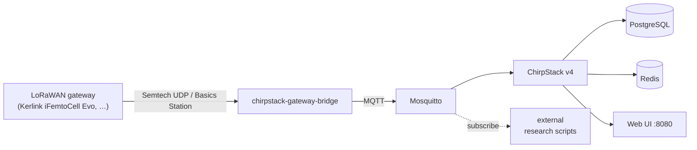

# whz-lora

A self-hosted LoRaWAN base for research sensorics at the
Westsächsische Hochschule Zwickau (WHZ).  Built on
[ChirpStack v4](https://www.chirpstack.io/) in Docker Compose,
designed to run on a single host without external network-server
dependencies.

## Status

| | |
|---|---|
| **F-0004 — Reproducible setup** | ✅ active |
| **F-0001 — Gateway connection** | ⏳ active for the gateway path (Kerlink iFemtoCell Evolution 868 live on KerOS 6.3.0); real-sensor uplink pending hardware |
| **F-0002 — Device management** | 🪪 simulator-mode covered; real-device codec work follows once the first sensor is on the bench |
| **F-0003 — MQTT forwarding** | 🪪 broker live, ACL enforced, sample subscriber documented; full coverage tied to F-0002 |

The smoke-test exercises the full pipeline end-to-end against the
simulator (`scripts/smoke_test.py`); a real Kerlink Wirnet iFemtoCell
Evolution 868 with EUI `7076FF0064071A3D` was brought online against
this stack on 2026-05-26.

## What this is

A bundled Docker-Compose stack that delivers:

- A **LoRaWAN Network Server** ([ChirpStack v4.18.0](https://www.chirpstack.io/))
  with its admin web UI on `:8080`
- **Gateway-bridge endpoints** for both Semtech UDP Packet Forwarder
  (UDP/1700) and Basics Station (TCP/3001)
- An **embedded MQTT broker** ([Eclipse Mosquitto 2.1.2](https://mosquitto.org/))
  on `:1883` with authentication and ACLs so external research scripts
  can subscribe to uplink events
- **PostgreSQL** (LNS persistence) and **Redis** (session and cache)
- A **Python smoke test** (`scripts/smoke_test.py`) that provisions a
  virtual gateway and device via gRPC, injects a MIC-valid LoRaWAN
  data uplink over UDP, and confirms the decoded JSON event lands on
  MQTT — the canonical verification check



## Quick start

Prerequisites on the host (one-time): Docker Desktop, Python 3.12+,
Node.js 20+, `gh` CLI, `pip install -r requirements.txt` for the
docs.  See [docs/user/getting-started.md](docs/user/getting-started.md)
for details, including the Windows firewall rules needed when
bringing a real gateway online.

```powershell
git clone https://github.com/theautomatist/whz-lora.git
cd whz-lora
Copy-Item .env.example .env
docker compose up -d --wait
```

When all six services report `(healthy)`, the management UI is at
[http://localhost:8080](http://localhost:8080) — default
`admin` / `admin`, password change forced on first sign-in.

Verify the install end-to-end:

```powershell
pip install -r scripts/requirements-test.txt
$env:MQTT_TEST_USERNAME = "testsubscriber"
$env:MQTT_TEST_PASSWORD = "testsubscriber"
$env:CHIRPSTACK_API_KEY = "change-me-api-key-from-chirpstack-ui"
python scripts/smoke_test.py
```

The last line should read `SUCCESS — end-to-end verification passed.`

## Documentation

Two audiences, two sites.  Both build to static HTML and are kept in
sync via the directive lifecycle (see below).

| Audience | Source | Serve locally |
|---|---|---|
| Operators of the network (Getting Started, gateway bring-up, FAQ) | [`docs/user/`](docs/user/) | `mkdocs serve -f mkdocs.user.yml` |
| Contributors (concept paper, features, ADRs, research) | [`docs/developer/`](docs/developer/) | `mkdocs serve -f mkdocs.developer.yml` |

Highlights:

- **[Concept paper](docs/developer/concept/concept-paper.md)** — the
  agreed scope, architecture, constraints, and verification method
- **[Feature registry](docs/developer/features.md)** — what the
  product does, single source of truth, kept in lockstep with the
  code
- **[Kerlink iFemtoCell Evolution bring-up](docs/user/kerlink-ifemtocell-bring-up.md)**
  — the operator-facing procedure with every gotcha we hit
- **[Architecture decisions](docs/developer/decisions/)** — the
  consequential calls and why we made them (LNS stack choice,
  verification toolchain, USB-NDIS topology, local-first CI …)

## How work happens

This is an AI-assisted project.  A Product Owner gives directives;
an AI team (`spec-analyst`, `implementer`, `reviewer`, `research`)
specifies, builds, verifies and documents each one through the
directive lifecycle — branch, draft PR, reviewer report, two PO gates
at the spec and at the delivery.  The full process and the team
definitions live in [`CLAUDE.md`](CLAUDE.md); the agent files are in
[`.claude/agents/`](.claude/agents/).

Verification runs **locally on the developer host** until the
project moves onto self-hosted GitLab — see
[ADR-0017](docs/developer/decisions/adr-0017.md); the GitHub Actions
workflow in `.github/workflows/ci.yml` stays as the basis for the
GitLab CI port.

## Repository layout

```
.
├─ docker-compose.yml          Production stack (6 services, pinned tags)
├─ .env.example                Stack variables; .env is gitignored
├─ chirpstack/                 ChirpStack server + EU868 region config
├─ chirpstack-gateway-bridge/  Basics Station EU868 TOML
├─ mosquitto/                  Broker config, ACL, runtime passwd entrypoint
├─ postgresql/initdb/          ChirpStack-required pg_trgm + hstore init
├─ codecs/                     Device codecs (JS) + node:test unit tests
├─ scripts/smoke_test.py       Verification check
├─ scripts/requirements-test.txt
├─ docs/                       mkdocs sites (user + developer)
└─ .claude/                    AI team agents, hooks, skills, MCP wiring
```

## Project info

| | |
|---|---|
| Owner | Carl, WHZ |
| Documentation language | English |
| LoRaWAN region | EU868 |
| LNS stack | ChirpStack v4.18.0 (see [ADR-0014](docs/developer/decisions/adr-0014.md)) |
| Verification toolchain | Python + chirpstack-api + UDP packet forwarder (see [ADR-0015](docs/developer/decisions/adr-0015.md)) |
| Repository policy | private, squash-merges only, branch protection deferred (see [ADR-0016](docs/developer/decisions/adr-0016.md)) |
