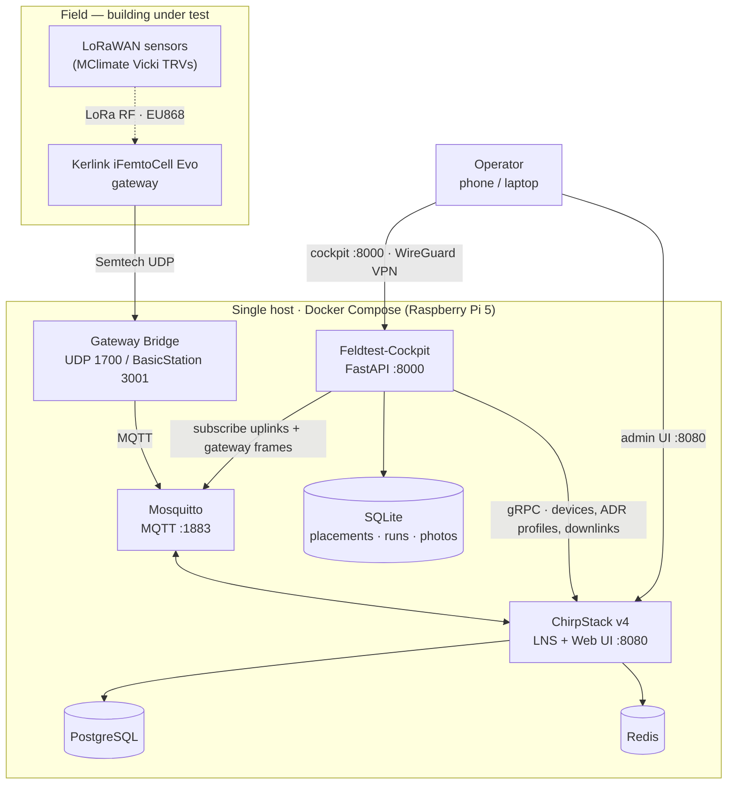
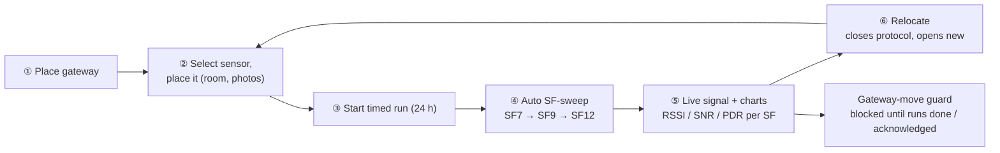

# whz-lora

**Self-hosted LoRaWAN base station (ChirpStack v4, Docker Compose) with a
field-measurement cockpit for research sensor coverage tests at the
Westsächsische Hochschule Zwickau (WHZ).**

A single-host stack that turns a Raspberry Pi — or any Docker host — into a
complete, self-contained LoRaWAN network (gateway bridge, network server,
broker, database) and adds a mobile-first **Feldtest-Cockpit** that walks an
operator through placing sensors around a building, running automated
spreading-factor sweeps, and tracking radio coverage live.

## The idea

WHZ runs its own LoRaWAN base for research sensorics — no dependency on a
public network server, full control over the RF and the data. Beyond just
*running* the network, the practical research question is **coverage**: where
can a sensor sit inside a building and still reach the gateway, and at which
spreading factor (SF)?

The cockpit answers that hands-on. You walk the building with a sensor, record
where you place it (room, notes, up to three photos), start a timed
measurement, and the system automatically sweeps the device through
**SF7 → SF9 → SF12** while logging received signal strength (RSSI), SNR and
packet-delivery ratio. Move the sensor and a new protocol opens; the gateway
can't be relocated until the running measurements are finished or
acknowledged. Everything is persisted, reboot-safe, and viewable live from a
phone over VPN.

## Architecture


```mermaid
flowchart TB
  subgraph Field["Field — building under test"]
    TRV["LoRaWAN sensors<br/>(MClimate Vicki TRVs)"]
    GW["Kerlink iFemtoCell Evo<br/>gateway"]
  end
  TRV -. "LoRa RF · EU868" .-> GW

  subgraph Host["Single host · Docker Compose (Raspberry Pi 5)"]
    BR["Gateway Bridge<br/>UDP 1700 / BasicStation 3001"]
    MQ["Mosquitto<br/>MQTT :1883"]
    CS["ChirpStack v4<br/>LNS + Web UI :8080"]
    PG[("PostgreSQL")]
    RD[("Redis")]
    CK["Feldtest-Cockpit<br/>FastAPI :8000"]
    SQ[("SQLite<br/>placements · runs · photos")]
  end

  GW -- "Semtech UDP" --> BR
  BR -- MQTT --> MQ
  MQ <--> CS
  CS --> PG
  CS --> RD
  CK -- "gRPC · devices, ADR profiles, downlinks" --> CS
  CK -- "subscribe uplinks + gateway frames" --> MQ
  CK --> SQ

  OP["Operator<br/>phone / laptop"]
  OP -- "cockpit :8000 · WireGuard VPN" --> CK
  OP -- "admin UI :8080" --> CS
```

## The field-measurement workflow


```mermaid
flowchart LR
  P["① Place gateway"] --> S["② Select sensor,<br/>place it (room, photos)"]
  S --> R["③ Start timed run (24 h)"]
  R --> W["④ Auto SF-sweep<br/>SF7 → SF9 → SF12"]
  W --> L["⑤ Live signal + charts<br/>RSSI / SNR / PDR per SF"]
  L --> M["⑥ Relocate<br/>closes protocol, opens new"]
  M --> S
  L --> G["Gateway-move guard<br/>blocked until runs done / acknowledged"]
```

The cockpit self-provisions the ChirpStack tenant, application and device
profiles, and holds each device at a fixed spreading factor **network-server
side** via ADR plugins (`fixed_dr5` = SF7, `fixed_dr3` = SF9, `fixed_dr0` =
SF12 — the MClimate Vicki has no device-side DR command). On run start it
puts the device on a 5-minute send interval by downlink so a sweep collects
enough packets, and a background scheduler steps the SF at each segment
boundary. A passive **Funkumgebung** scan continuously counts our own frames
against foreign networks the gateway overhears. Every run writes a CSV and an
in-cockpit line chart of RSSI over time, coloured by SF stage.

## What's in the stack

Seven pinned Docker services:

- **ChirpStack v4.18.0** — the LoRaWAN Network Server + admin web UI (`:8080`)
- **Gateway Bridge** ×2 — Semtech UDP Packet Forwarder (`UDP/1700`) and
  Basics Station (`TCP/3001`)
- **Mosquitto 2.1.2** — MQTT broker (`:1883`) with authentication and ACLs so
  external research scripts can subscribe to uplink events
- **PostgreSQL 14** and **Redis 7** — LNS persistence, session and cache
- **Feldtest-Cockpit** — a FastAPI web app (`:8000`, HTTP Basic auth) for the
  field-measurement workflow; talks gRPC to ChirpStack, subscribes to MQTT,
  and persists placements/runs/photos to SQLite in the `cockpit-data` volume

## Quick start

Prerequisites on the host (one-time): Docker, Python 3.12+, Node.js 20+,
`gh` CLI. See [docs/user/getting-started.md](docs/user/getting-started.md)
for details, including the Windows firewall rules needed when bringing a real
gateway online.

```powershell
git clone https://github.com/theautomatist/whz-lora.git
cd whz-lora
Copy-Item .env.example .env    # then set the passwords/secrets inside
docker compose up -d --wait
```

When all seven services report `(healthy)`:

- **Admin UI** — [http://localhost:8080](http://localhost:8080)
  (`admin` / `admin`, password change forced on first sign-in)
- **Feldtest-Cockpit** — [http://localhost:8000](http://localhost:8000)
  (`COCKPIT_USER` / `COCKPIT_PASSWORD` from `.env`)

## Verification

Three layers, all runnable locally:

```powershell
# End-to-end pipeline against the simulator (the canonical verification check)
pip install -r scripts/requirements-test.txt
$env:MQTT_TEST_USERNAME = "testsubscriber"
$env:MQTT_TEST_PASSWORD = "testsubscriber"
$env:CHIRPSTACK_API_KEY = "change-me-api-key-from-chirpstack-ui"
python scripts/smoke_test.py            # -> "SUCCESS — end-to-end verification passed."

node --test codecs/*.test.js            # device-codec unit tests
pytest cockpit/tests -q                 # cockpit backend tests
```

The smoke test provisions a virtual gateway and device via gRPC, injects a
MIC-valid LoRaWAN uplink over UDP, and confirms the decoded JSON event lands
on MQTT. A real Kerlink Wirnet iFemtoCell Evolution 868
(EUI `7076FF0064071A3D`) was brought online against this stack on 2026-05-26.

## Documentation

Two audiences, two static sites, kept in sync through the directive lifecycle:

| Audience | Source | Serve locally |
|---|---|---|
| Operators (getting started, gateway bring-up, FAQ) | [`docs/user/`](docs/user/) | `mkdocs serve -f mkdocs.user.yml` |
| Contributors (concept paper, features, ADRs, research) | [`docs/developer/`](docs/developer/) | `mkdocs serve -f mkdocs.developer.yml` |

Highlights: the
**[concept paper](docs/developer/concept/concept-paper.md)** (scope,
architecture, constraints, verification method), the
**[feature registry](docs/developer/features.md)** (single source of truth
for what the product does), the
**[Kerlink bring-up guide](docs/user/kerlink-ifemtocell-bring-up.md)**, and
the **[architecture decisions](docs/developer/decisions/)**.

## How work happens

This is an AI-assisted project. A Product Owner gives directives; an AI team
(`spec-analyst`, `implementer`, `reviewer`, `research`) specifies, builds,
verifies and documents each one through the directive lifecycle — branch,
draft PR, reviewer report, two PO gates at the spec and at the delivery. The
full process and the team definitions live in [`CLAUDE.md`](CLAUDE.md); the
agent files are in [`.claude/agents/`](.claude/agents/).

Verification runs **locally on the developer host** until the project moves
onto self-hosted GitLab (see
[ADR-0017](docs/developer/decisions/adr-0017.md)); the GitHub Actions workflow
in `.github/workflows/ci.yml` stays as the basis for the GitLab CI port.

## Repository layout

```
.
├─ docker-compose.yml          Production stack (7 services, pinned tags)
├─ .env.example                Stack variables; .env is gitignored
├─ chirpstack/                 LNS + EU868 region config + fixed-SF ADR plugins
├─ chirpstack-gateway-bridge/  Basics Station EU868 TOML
├─ mosquitto/                  Broker config, ACL, runtime passwd entrypoint
├─ postgresql/initdb/          ChirpStack-required pg_trgm + hstore init
├─ cockpit/                    Feldtest-Cockpit (FastAPI app + static UI + tests)
├─ codecs/                     Device codecs (JS) + node:test unit tests
├─ scripts/                    smoke_test.py, device registration, requirements
├─ docs/                       mkdocs sites (user + developer)
└─ .claude/                    AI team agents, hooks, skills, MCP wiring
```

## Project info

| | |
|---|---|
| Owner | WHZ |
| Field-test host | Raspberry Pi 5, reachable via WireGuard VPN (eduroam) |
| Documentation language | English |
| LoRaWAN region | EU868 |
| LNS stack | ChirpStack v4.18.0 (see [ADR-0014](docs/developer/decisions/adr-0014.md)) |
| Verification toolchain | Python + chirpstack-api + UDP packet forwarder (see [ADR-0015](docs/developer/decisions/adr-0015.md)) |
| Repository policy | private, squash-merges only (see [ADR-0016](docs/developer/decisions/adr-0016.md)) |
