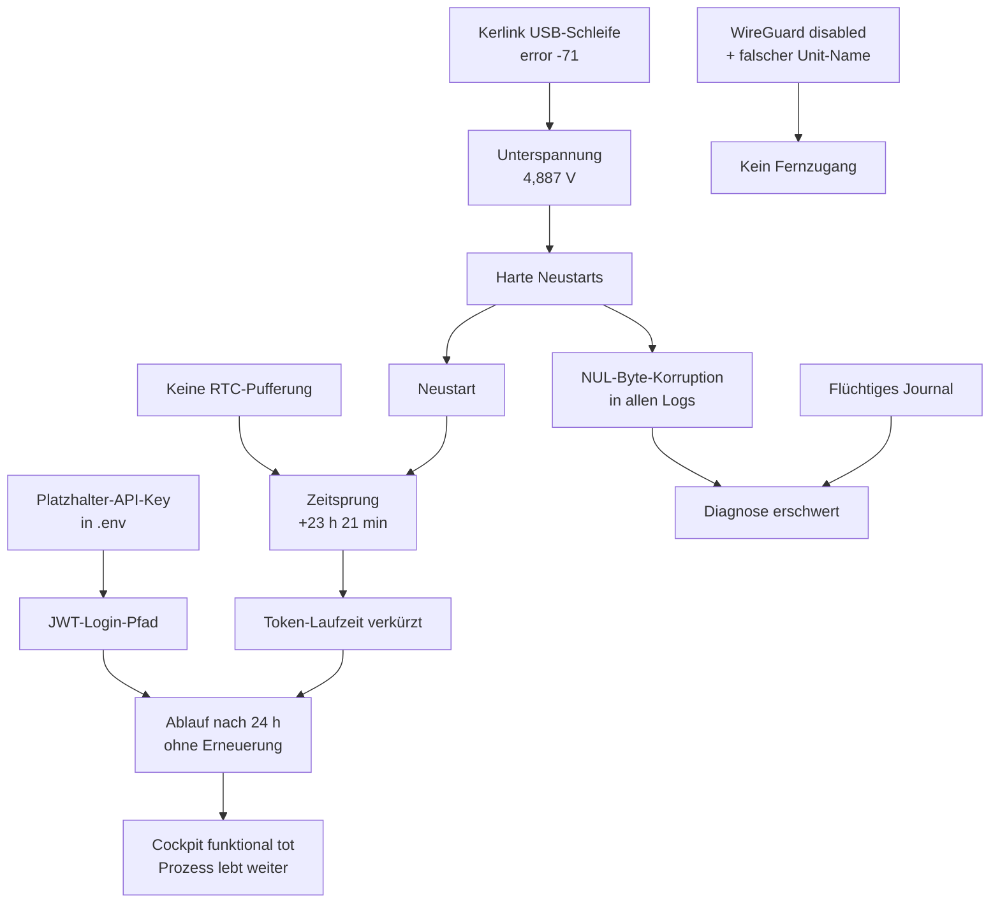

# Störungsanalyse Feldtest-Host — 2026-08-01

Ausführliche System- und Serviceanalyse des Raspberry Pi 5, auf dem der
whz-lora-Stack betrieben wird. Anlass: Der Host war **nicht mehr zuverlässig
erreichbar**, und das **Feldtest-Cockpit lief nach einiger Zeit nicht mehr
richtig** bzw. ließ sich nicht mehr bedienen.

> **Hinweis zur Sprache:** Dieser Bericht ist auf Deutsch verfasst — abweichend
> von der in `CLAUDE.md` festgelegten Doku-Sprache Englisch, konsistent mit den
> übrigen deutschsprachigen Dokumenten in `docs/developer/analysis/`
> (Fragenkatalog, Prozessmodell, Testkonzept).

## Ergebnis in einem Satz

Es handelt sich **nicht um einen Fehler, sondern um drei voneinander
unabhängige Fehler**, die zusammen exakt das beobachtete Störungsbild ergeben:
ein abgelaufenes, nie erneuertes ChirpStack-Token legt das Cockpit nach genau
24 Stunden funktional lahm, ein nie aktivierter WireGuard-Dienst macht den Host
über VPN unerreichbar, und eine unzureichende Stromversorgung in Kombination
mit dem USB-angebundenen Kerlink-Gateway erzeugt Unterspannung, harte
Neustarts und nachweisbare Datenkorruption.

## Kernbefunde

| # | Befund | Schwere | Status |
|---|---|---|---|
| **B-1** | Cockpit-Token läuft nach exakt 24 h ab und wird nie erneuert → alle ChirpStack-Funktionen tot, Prozess lebt weiter | **Kritisch** | Belegt |
| **B-2** | WireGuard (`wg-quick@wg0`) ist `disabled`; die Konfiguration heißt `PI5.conf`, nicht `wg0.conf` → VPN-Zugang existiert faktisch nicht | **Kritisch** | Belegt |
| **B-3** | Unterspannung + USB-Enumerationsschleife des Kerlink-Gateways → harte Neustarts, NUL-Byte-Korruption in allen Container-Logs | **Kritisch** | Belegt |
| **B-4** | Keine gepufferte RTC → Systemzeit springt beim Boot um Stunden bis Tage nach vorn | **Hoch** | Belegt |
| **B-5** | Keine Docker-Log-Rotation → 639 MB Logdaten, `docker logs` teilweise unbrauchbar | **Hoch** | Belegt |
| **B-6** | `cgroup_disable=memory` im Kernel → Docker kann keine Speicherlimits durchsetzen | **Hoch** | Belegt |
| **B-7** | ChirpStack verliert 1.166-mal die MQTT-Namensauflösung (`Name does not resolve`) | **Mittel** | Belegt |
| **B-8** | Healthchecks im 5-Sekunden-Takt → ~17.280 MQTT-Verbindungen/Tag, Hauptquelle des Log-Volumens | **Mittel** | Belegt |
| **B-9** | systemd-Journal ist flüchtig (`/run`) → nach jedem Neustart keine Forensik möglich | **Mittel** | Belegt |
| **B-10** | Zwei IP-Adressen im selben Subnetz (eth0 + wlan0), WLAN-Powersave aktiv | **Mittel** | Belegt |
| **B-11** | SQLite im Rollback-Journal statt WAL — Schreiber blockieren Leser | **Niedrig** | Belegt |
| **B-12** | Deployment-Verzeichnis ist kein Git-Repository → laufender Stand nicht nachvollziehbar | **Niedrig** | Belegt |

## Untersuchungsumfang und Methodik

- **Host:** Raspberry Pi 5 Model B Rev 1.0, Debian 13 (trixie),
  Kernel 6.18.34+rpt-rpi-2712, 4 GB RAM, 64-GB-SD-Karte (`SN64G`).
- **Zugang:** SSH als `carl` über das lokale Netz. Der Host war unter der in
  `~/.ssh/config` hinterlegten VPN-Adresse `10.8.0.4` **nicht** erreichbar; er
  wurde per ARP-/Port-Scan im Subnetz `192.168.212.0/24` lokalisiert
  (MAC-OUI `2C:CF:67` = Raspberry Pi Foundation).
- **Zeitpunkt:** 2026-08-01, ca. 13:35–13:55 CEST. Der Host war zu Beginn der
  Untersuchung erst ~8 Minuten in Betrieb.
- **Datenquellen:** `dmesg`, systemd-Journal, `vcgencmd`, Docker-Inspect und
  ‑Stats, rohe Container-Logdateien unter `/var/lib/docker/containers/`,
  PostgreSQL- und SQLite-Abfragen, Live-Test der gRPC-Authentifizierung.

**Wichtige Einschränkung:** Der Host lief zum Untersuchungszeitpunkt frisch
hochgefahren. Der Fehlerzustand des Cockpits tritt erst nach 24 Stunden auf und
war daher **nicht live reproduzierbar**. Die Beweisführung stützt sich auf die
historischen Container-Logs, die drei Wochen zurückreichen, sowie auf einen
direkten Messtest der Token-Lebensdauer.

## Adressen und Interfaces

| Interface | Adresse | Bemerkung |
|---|---|---|
| `eth0` | 192.168.212.136/24 | Default-Route, Metrik 100 |
| `wlan0` | 192.168.212.144/24 | Default-Route, Metrik 600, SSID `226YTG` |
| `usb0` | 192.168.120.31/24 | CDC-EEM-Link zum Kerlink-Gateway (`.1`) |
| `wlan1` | — | AVM Fritz!WLAN-USB-Stick, `DOWN`, ungenutzt |
| WireGuard | — | **nicht aktiv** (siehe B-2) |

---

# Teil 1 — Serviceanalyse

## B-1 — Cockpit: Token läuft nach 24 h ab und wird nie erneuert

**Das ist die Ursache für „das Webinterface lässt sich nach einiger Zeit nicht
mehr bedienen".**

### Wirkkette

1. In der `.env` auf dem Pi steht
   `CHIRPSTACK_API_KEY=change-me-api-key-from-chirpstack-ui` — der
   **unveränderte Platzhalter** aus `.env.example`.
2. `cockpit/app/chirpstack.py:60` (`get_token`) erkennt den Platzhalter über
   `_is_placeholder()` und weicht auf den **Admin-JWT-Login** aus
   (`admin`/`admin`).
3. Dieses JWT hat eine Gültigkeit von **exakt 24,0 Stunden** (live gemessen,
   siehe unten).
4. `cockpit/app/main.py:160` holt das Token **genau einmal beim Start** und legt
   es in der Modulvariablen `_grpc_token` ab (`main.py:114`).
5. Es gibt **keinerlei Erneuerung** — kein Refresh, kein Retry-on-401, keine
   Ablaufprüfung. Alle 8 Aufrufstellen verwenden `_grpc_token` unverändert.

Nach 24 Stunden schlägt daher **jeder** ChirpStack-Aufruf dauerhaft mit
`UNAUTHENTICATED: ExpiredSignature` fehl — bis der Container neu gestartet wird.

### Messung der Token-Lebensdauer

Direkt im laufenden Cockpit-Container ausgeführt:

```
claims: {"aud":"chirpstack","exp":1785671225,"iss":"chirpstack",
         "sub":"00ce0346-05b4-4f29-958b-b7acbef08c88","typ":"user"}
container clock (UTC): 2026-08-01T11:47:05
exp (UTC):             2026-08-02T11:47:05
TTL hours from now:    24.0
```

### Nachweis im Betrieb

Zwei unabhängige Vorfälle, jeweils exakt 24 Stunden nach dem Start:

| Cockpit-Start | Erster `ExpiredSignature` | Abstand |
|---|---|---|
| 2026-07-10 08:10:35 UTC | 2026-07-11 08:20:39 UTC | **24 h 10 min** |
| 2026-07-13 11:57:22 UTC | 2026-07-14 11:58:30 UTC | **24 h 01 min** |

Der zweite Vorfall zeigt die Auswirkung besonders deutlich. Am 14.07. finden
sich **324 Fehlermeldungen** dieser Form:

```
WARNING:app.main:config-status: GetQueue failed for 70b3d52dd30080a2: ExpiredSignature
```

Sie laufen ab 11:58 Uhr **im Minutentakt durch** bis mindestens 16:58 Uhr. Es
handelt sich um `main.py:1771` (`cs.get_device_queue`) — den Endpunkt, den die
Weboberfläche zyklisch pollt, um den Konfigurationsstatus anzuzeigen.

Der nächste Neustart erfolgte erst am **17.07. um 10:50 Uhr**. Das Cockpit lief
also rund **drei Tage lang mit vollständig toter ChirpStack-Anbindung**.

### Warum das Symptom so schwer zu greifen war

Der Prozess **stirbt nicht**. `/healthz` antwortet weiter mit HTTP 200, der
Docker-Healthcheck bleibt `healthy`, `restarts=0`. Die Zeilenzahl im Log liegt
konstant bei ~2.866 pro Tag (Healthcheck alle 30 s = 2.880/Tag) — der Container
läuft lückenlos durch. Nach außen wirkt alles gesund; tatsächlich funktioniert
jede Funktion, die ChirpStack braucht, nicht mehr: Geräteliste, SF-Umschaltung,
Downlink-Konfiguration, Queue-Status.

### Verschärfung durch B-4

Da die Systemzeit beim Booten um Stunden bis Tage nach vorn springt (siehe
B-4), wird das Token unter Umständen mit einer **zurückliegenden** Uhrzeit
ausgestellt. Springt die Uhr danach um mehr als 24 Stunden vorwärts, ist das
Token **sofort nach dem Start abgelaufen**. Beim aktuellen Boot betrug der
Sprung 23 h 21 min — das Cockpit hätte in diesem Fall nur noch etwa 39 Minuten
funktioniert.

### Empfehlung

1. **Sofortmaßnahme:** Einen echten, nicht ablaufenden API-Key in der
   ChirpStack-Weboberfläche erzeugen und in die `.env` eintragen. Damit
   entfällt der JWT-Pfad vollständig. Das ist der vom Code ohnehin bevorzugte
   Weg und behebt den Fehler ohne Codeänderung.
2. **Dauerhafte Lösung:** `get_token()` um Ablauferkennung erweitern und die
   Aufrufstellen auf einen Wrapper umstellen, der bei `UNAUTHENTICATED` einmal
   neu anmeldet und den Aufruf wiederholt.
3. **Absicherung:** Beim Start eine Warnung ausgeben, wenn der Platzhalter-Key
   aktiv ist — analog zur bereits vorhandenen Warnung für `COCKPIT_PASSWORD`
   (`main.py:133`).

## B-7 — ChirpStack verliert die MQTT-Namensauflösung

In den ChirpStack-Logs stehen **1.166 Fehler** (je 583 in zwei Modulen):

```
ERROR chirpstack::integration::mqtt: MQTT error
      error=I/O: failed to lookup address information: Name does not resolve
ERROR chirpstack::gateway::backend::mqtt: MQTT error
      error=I/O: failed to lookup address information: Name does not resolve
```

ChirpStack kann den Container-Namen `mosquitto` zeitweise nicht über den
eingebetteten Docker-DNS (127.0.0.11) auflösen. In diesen Phasen bricht der
gesamte Uplink-Fluss ab — Gateway-Daten erreichen den Netzwerkserver nicht.

Das ist ein **eigenständiger Fehler**, unabhängig von B-1. Als Auslöser kommen
Ressourcenengpässe des Docker-Daemons und die Neustarts der Netzwerk-Stacks
nach den Stromereignissen (B-3) in Betracht; eine abschließende Zuordnung war
im Untersuchungszeitraum nicht möglich.

**Empfehlung:** MQTT-Ziel auf eine feste Container-IP oder ein
`extra_hosts`-Mapping umstellen oder — sauberer — eine Retry-Strategie mit
DNS-Cache aktivieren. Zunächst sollte jedoch B-3 behoben werden, da die
Fehlerhäufung zeitlich mit den Stromereignissen korreliert.

## Weitere Service-Befunde

### Container-Zustand (Momentaufnahme)

Alle sieben Dienste liefen zum Untersuchungszeitpunkt:

| Container | Status | Restarts | Healthcheck |
|---|---|---|---|
| `cockpit` | Up | 0 | healthy |
| `mosquitto` | Up | 0 | healthy |
| `chirpstack` | Up | **3** | keiner |
| `chirpstack-gateway-bridge` | Up | 0 | keiner |
| `chirpstack-gateway-bridge-basicstation` | Up | 0 | keiner |
| `postgres` | Up | 0 | healthy |
| `redis` | Up | 0 | healthy |

**ChirpStack startet bei jedem Boot dreimal neu** (`exitCode=1`), obwohl
`depends_on: service_healthy` für Postgres, Redis und Mosquitto gesetzt ist.
Der Dienst benötigt offenbar länger, als der Healthcheck signalisiert. Da die
drei Gateway-Bridge- und ChirpStack-Container **keinen Healthcheck** besitzen,
fällt so ein Zustand im Normalbetrieb nicht auf.

### B-8 — Healthcheck-Frequenz erzeugt das Log-Volumen

Mosquitto, PostgreSQL und Redis prüfen im **5-Sekunden-Takt**. Der
Mosquitto-Healthcheck baut dabei jedes Mal eine echte MQTT-Verbindung auf:

```
New connection from 127.0.0.1:33148 on port 1883.
```

Das ergibt **17.280 Verbindungen pro Tag**. In den letzten 5.000 Logzeilen
entfielen 1.463 auf genau diese Meldung. Das Mosquitto-Log umfasst
**1.488.436 Zeilen / 259 MB** — nahezu vollständig Healthcheck-Rauschen.

**Empfehlung:** Intervall auf 30 s anheben und in `mosquitto.conf`
`connection_messages false` setzen.

### B-5 — Keine Log-Rotation

`/etc/docker/daemon.json` existiert nicht, es gilt der Standardtreiber
`json-file` **ohne Größenbegrenzung**. Aktueller Stand:

| Container | Zeilen | Größe |
|---|---|---|
| chirpstack | 664.393 | **322 MB** |
| mosquitto | 1.488.436 | **259 MB** |
| gateway-bridge (UDP) | 154.050 | 36 MB |
| redis | 81.917 | 12 MB |
| cockpit | 72.409 | 9,6 MB |
| **Summe** | | **639 MB** |

Auf einer SD-Karte ist das nicht nur ein Platz-, sondern vor allem ein
Verschleiß- und I/O-Problem. Zusätzlich verursacht ChirpStack mit
`level="info"` massiven Eigenanteil: rund 4.500 Meldungen „Metrics saved" und
„Gateway partially updated" je 40.000 Zeilen.

**Empfehlung:** `/etc/docker/daemon.json` mit
`{"log-driver":"json-file","log-opts":{"max-size":"10m","max-file":"3"}}`
anlegen, ChirpStack auf `level="warn"` setzen.

### B-11 — SQLite-Konfiguration und Datenwachstum

`cockpit.db` (7,7 MB) läuft im Journal-Modus **`delete`**, nicht `WAL`. In
diesem Modus blockieren Schreibvorgänge gleichzeitige Lesevorgänge, und jeder
Commit erzwingt mehrere `fsync`-Operationen auf die SD-Karte. Das Cockpit
schreibt bei jedem Uplink einen `rf_frame`-Datensatz und liest parallel für die
Weboberfläche.

Tabellenstand: `rf_frame` **55.095 Zeilen**, `placement` 10, `run` 7, `node` 5.

> **Korrektur (2026-08-01, nach Prüfung des Quellcodes):** Eine frühere Fassung
> dieses Berichts führte hier zusätzlich „`rf_frame` ohne Retention, wächst
> unbegrenzt" auf. Das ist **falsch**. `db.py` begrenzt die Tabelle über
> `RF_FRAME_RETENTION_MAX = 200_000` und trimmt alle 500 Einfügungen
> (`_trim_rf_frames`). Mit 55.095 Zeilen liegt sie deutlich unter dem Limit;
> ein Datenwachstumsproblem besteht nicht. Der Journal-Modus-Befund oben
> bleibt davon unberührt.

Belegte `database is locked`-Fehler traten im gesamten Log **nicht** auf; das
Problem ist derzeit latent, nicht akut.

**Empfehlung:** `PRAGMA journal_mode=WAL` beim Start setzen.

### B-12 — Deployment ohne Git-Bezug

`/home/carl/whz-lora` ist **kein Git-Repository**. Der laufende Codestand lässt
sich keinem Commit zuordnen, Änderungen am Pi sind nicht nachvollziehbar, und
ein Rollback ist nicht möglich. Für ein Projekt mit formalem Direktiven- und
Gate-Prozess ist das eine erhebliche Lücke.

### Datenlage der LoRaWAN-Geräte

Aus der ChirpStack-Datenbank:

| Gerät | Zuletzt gesehen |
|---|---|
| `whz-kerlink-ifevo` (Gateway) | 2026-08-01 11:47:46 — **aktiv** |
| EVA (`70b3d52dd30080a2`) | 2026-07-21 08:20:54 |
| thermostat-maurice | 2026-07-16 08:36:12 |
| thermostat-katia | 2026-07-16 08:03:40 |
| HomeMatic - DNT | **nie** |

Das Gateway liefert aktuell Daten. Die Sensoren schweigen jedoch seit dem
16.–21. Juli. Zusätzlich verzeichnet ChirpStack **35 verworfene
Downlink-Queue-Einträge** (`Device queue-item discarded because of timeout`) —
das betrifft genau den Mechanismus, mit dem das Cockpit das Sendeintervall der
Geräte setzt. Ob die Sensoren abgeschaltet, entladen oder außer Reichweite sind,
konnte aus der Ferne nicht geklärt werden und sollte vor Ort geprüft werden.

---

# Teil 2 — Systemanalyse

## B-3 — Stromversorgung und Kerlink-USB-Schleife

**Das ist die Ursache für die sporadische Nichterreichbarkeit und die
Datenkorruption.**

### Belege

`vcgencmd get_throttled` liefert **`0x50000`**. Gesetzt sind Bit 16
(*Unterspannung ist aufgetreten*) und Bit 18 (*Drosselung ist aufgetreten*) —
und zwar **innerhalb der ersten 13 Betriebsminuten**.

Die gemessene Eingangsspannung liegt bei **`EXT5V_V = 4,887 V`**, also unterhalb
der Nennspannung. Ein Raspberry Pi 5 benötigt offiziell 5 V bei 5 A (25 W) über
USB-C PD.

Im Kernel-Log sind die Ereignisse direkt nachvollziehbar:

```
[13:32:28] hwmon hwmon2: Undervoltage detected!
[13:32:38] hwmon hwmon2: Voltage normalised
[13:32:56] hwmon hwmon2: Undervoltage detected!
[13:33:05] hwmon hwmon2: Voltage normalised
[13:33:09] hwmon hwmon2: Undervoltage detected!
[13:33:11] hwmon hwmon2: Voltage normalised
```

### Der Auslöser: das Kerlink-Gateway

Zeitgleich läuft das USB-angebundene Kerlink-Gateway in eine
**Enumerationsschleife**:

```
usb 1-2: New USB device found, idVendor=0525, idProduct=a4a2
usb 1-2: Product: Wirnet Gateway / Manufacturer: Kerlink
cdc_eem 1-2:1.0 usb0: register 'cdc_eem' ...
usb 1-2: USB disconnect, device number 25
usb usb1-port2: Cannot enable. Maybe the USB cable is bad?
usb 1-2: device descriptor read/64, error -71
usb usb1-port2: attempt power cycle
```

Innerhalb von rund 70 Sekunden durchlief das Gerät die Gerätenummern 2 bis 26 —
über **20 Verbindungsabbrüche**. Jeder Zyklus zieht einen Stromstoß, der die
Unterspannungserkennung auslöst. Die Gateway-Bridge protokolliert
spiegelbildlich **62 Topic-Anmeldungen gegen 59 Abmeldungen** desselben
Gateways.

Der Fehlercode `-71` (`EPROTO`) zusammen mit „Cannot enable. Maybe the USB cable
is bad?" deutet auf ein **Kabel- oder Leistungsproblem**, nicht auf einen
Software-Fehler.

### Folgeschaden: nachgewiesene Datenkorruption

Alle nennenswert großen Container-Logdateien enthalten **NUL-Bytes** — ein
klassisches Anzeichen für abgeschnittene Schreibvorgänge bei hartem
Stromverlust unter ext4 (`data=ordered`):

| Container | NUL-Bytes |
|---|---|
| chirpstack | 14.491 |
| mosquitto | 11.641 |
| gateway-bridge (UDP) | 1.942 |
| cockpit | 621 |
| redis | 402 |
| postgres | 0 |
| basicstation | 0 |

Die Auswirkung ist praktisch spürbar: `docker logs whz-lora-cockpit-1` bricht
an der ersten Korruptionsstelle ab und liefert nur **12.127 von 72.409 Zeilen**
— die Historie endet scheinbar am 13.07., obwohl die Datei bis heute
weitergeschrieben wird. Die vollständige Auswertung war nur über die rohe
Logdatei mit entfernten NUL-Bytes möglich.

Zusätzlich meldet der Kernel beim Start:

```
EXT4-fs (mmcblk0p2): orphan cleanup on readonly fs
```

Das Dateisystem wurde also **nicht sauber ausgehängt**.

Verschärfend kommt hinzu, dass der **Hardware-Watchdog mit 60 Sekunden Timeout
aktiv** ist (`reboot=w`, `bcm2835-wdt`). Bleibt das System durch einen
Unterspannungs- oder I/O-Stall stehen, löst der Watchdog einen harten Neustart
aus — ohne Chance auf sauberes Herunterfahren.

### Empfehlung

1. Offizielles **27-W-USB-C-PD-Netzteil** verwenden (Raspberry Pi 5 benötigt
   5 V/5 A).
2. Das Kerlink-Gateway **nicht über den Pi mit Strom versorgen**, sondern über
   ein eigenes Netzteil; USB nur als Datenverbindung nutzen.
3. **USB-C-Datenkabel tauschen** — Fehler `-71` deutet unmittelbar darauf hin.
4. Nach der Maßnahme `vcgencmd get_throttled` prüfen; der Wert muss dauerhaft
   `0x0` bleiben.
5. Ungenutzten AVM-WLAN-Stick (`wlan1`, `DOWN`) entfernen — er zieht ohne Nutzen
   Strom.

## B-4 — Keine gepufferte Echtzeituhr, Systemzeit springt

Der Kernel meldet beim Start:

```
rpi-rtc soc@107c000000:rpi_rtc: setting system clock to 1970-01-01T00:00:14 UTC
```

Der Pi 5 besitzt eine RTC, aber **keine Pufferbatterie**. Der Ablauf im
untersuchten Boot:

1. Start am **01.08. um 13:32:05 CEST** (belegt durch `/proc/uptime` = 800 s).
2. Die Uhr wird zunächst auf **31.07. 14:10:36** gesetzt — den zuletzt
   gespeicherten Zeitstempel.
3. Der komplette Docker-Stack startet unter dieser **falschen Zeit**.
4. Erst um **13:32:38** greift NTP:
   `Initial clock synchronization to Sat 2026-08-01 13:32:38 CEST`.
5. Die Uhr springt um **23 Stunden 21 Minuten** nach vorn.

Im Journal ist der Sprung direkt sichtbar — Zeile 1692 auf 1693:

```
2026-07-31T14:11:06+02:00  hwmon hwmon2: Voltage normalised
2026-08-01T13:32:38+02:00  systemd-timesyncd: Initial clock synchronization ...
```

### Auswirkungen

- **Alle Container tragen falsche Startzeitpunkte.** `docker ps` meldet
  „Up 24 hours" für Container, die seit 13 Minuten laufen.
- **Die Token-Lebensdauer wird verkürzt** — im Extremfall auf null (siehe B-1).
- **Zeitbezogene Docker-Abfragen versagen.** `docker logs --since 2m` lieferte
  null Treffer, obwohl im fraglichen Zeitraum durchgehend protokolliert wurde.
- **Messläufe und der SF-Sweep sind gefährdet.** Der Hintergrund-Scheduler
  arbeitet mit Segmentgrenzen und 24-Stunden-Laufzeiten; ein Zeitsprung dieser
  Größenordnung während eines laufenden Feldtests verfälscht die Zuordnung von
  Messpunkten zu SF-Stufen oder beendet den Lauf vorzeitig.
- **CSV-Exporte und Datenbankzeitstempel** können in sich inkonsistent werden.

### Empfehlung

1. **RTC-Pufferbatterie** am dafür vorgesehenen Anschluss des Pi 5 nachrüsten
   (~5 €). Das beseitigt die Ursache.
2. Ersatzweise `fake-hwclock` installieren — derzeit **nicht vorhanden**
   (`systemctl is-enabled fake-hwclock` → `not-found`).
3. Den Docker-Dienst so konfigurieren, dass er erst nach
   `time-sync.target` startet, damit der Stack nie unter falscher Zeit
   hochfährt.

## B-2 — WireGuard ist nicht aktiv

Der in `~/.ssh/config` hinterlegte Zugang `whz-pi → 10.8.0.4` schlug mit
Zeitüberschreitung fehl. Grund:

```
wg-quick@wg0.service - WireGuard via wg-quick(8) for wg0
   Loaded: loaded (/usr/lib/systemd/system/wg-quick@.service; disabled)
   Active: inactive (dead)
```

Der Dienst ist **weder aktiv noch für den Autostart eingerichtet**. Erschwerend
kommt hinzu, dass die Konfigurationsdatei **`/etc/wireguard/PI5.conf`** heißt —
die Unit `wg-quick@wg0` würde also selbst nach Aktivierung eine nicht
vorhandene `wg0.conf` suchen. Korrekt wäre `wg-quick@PI5`.

Damit ist der dokumentierte Fernzugang („Field-test host, reachable via
WireGuard VPN (eduroam)", README) faktisch nicht vorhanden. **Dies allein
erklärt bereits, warum der Pi „nicht mehr zuverlässig erreichbar" war.**

**Empfehlung:**

```bash
sudo systemctl enable --now wg-quick@PI5
```

Anschließend die Namenskonvention vereinheitlichen (Datei nach `wg0.conf`
umbenennen oder die Dokumentation auf `PI5` anpassen) und den Zustand in der
Betriebsdokumentation festhalten.

## B-10 — Netzwerkkonfiguration

Der Host hat **zwei Adressen im selben Subnetz**: `eth0` mit 192.168.212.136
(Metrik 100) und `wlan0` mit 192.168.212.144 (Metrik 600). Beide besitzen eine
Default-Route zum selben Gateway.

Das führt zu asymmetrischem Routing: Anfragen an die WLAN-Adresse werden über
die Ethernet-Schnittstelle beantwortet. Die Verwerfungszähler stützen das —
`eth0` verwirft 516 von 2.675 empfangenen Paketen (19 %), `wlan0` 558 von 755
(74 %). `rp_filter` steht auf `2` (loose), fängt also nicht alles ab.

Zusätzlich ist am WLAN **Powersave aktiv** (`Power save: on`) — eine bekannte
Ursache für verzögerte oder ausbleibende Antworten nach Ruhephasen. Die
Empfangsrate von 1,0 MBit/s bei einem Signalpegel von −35 dBm ist auffällig
niedrig.

**Empfehlung:** Eine der beiden Schnittstellen deaktivieren — im stationären
Betrieb `wlan0` — oder wenigstens dem WLAN Powersave abschalten
(`iw dev wlan0 set power_save off`). Für den Feldbetrieb sollte eine feste
Adresse per DHCP-Reservierung vergeben werden.

## B-6 — Speicher-Cgroup deaktiviert

Die Kernel-Kommandozeile enthält **`cgroup_disable=memory`**. Folgen:

- `docker stats` meldet für alle Container `0B / 0B` — **Speicherverbrauch ist
  nicht messbar**.
- Docker kann **keine Speicherlimits durchsetzen**; alle Container laufen mit
  `memlimit=0`.
- Ein Speicherleck in einem einzelnen Dienst kann daher den **gesamten Host**
  in Swapping und OOM treiben, statt nur den betroffenen Container zu treffen.

Das ist ein ernstzunehmender Faktor für die gemeldete Nichterreichbarkeit: Ein
langsam wachsender Prozess bringt so den kompletten Pi zum Stillstand, ohne dass
es im Nachhinein nachweisbar wäre. OOM-Ereignisse waren im aktuellen Boot nicht
zu finden — bei flüchtigem Journal (B-9) sagt das über frühere Vorfälle jedoch
nichts aus.

**Empfehlung:** `cgroup_disable=memory` aus `/boot/firmware/cmdline.txt`
entfernen und stattdessen `cgroup_enable=memory cgroup_memory=1` setzen.
Anschließend Speicherlimits für die Container definieren.

## B-9 — Journal ist flüchtig

```
File path: /run/log/journal/ed0b8139.../system.journal
```

`/var/log/journal/` existiert, ist aber **leer**; `Storage=auto` fällt damit auf
flüchtige Speicherung in `/run` zurück. `journalctl --list-boots` kennt genau
**einen** Boot.

Konsequenz: **Nach jedem Neustart sind sämtliche Systemlogs verloren.** Genau
die Informationen, die für die Diagnose sporadischer Ausfälle nötig wären —
Absturzursache, OOM-Kills, Watchdog-Auslösungen, letzter Herunterfahrgrund —
existieren nicht mehr. Die vorliegende Analyse musste sich deshalb auf die
Docker-Logs stützen.

**Empfehlung:**

```bash
sudo mkdir -p /var/log/journal && sudo systemd-tmpfiles --create --prefix /var/log/journal
sudo systemctl restart systemd-journald
```

Zusammen mit `SystemMaxUse=200M` in `/etc/systemd/journald.conf`, um die
SD-Karte zu schonen.

## Unauffällige Bereiche

Der Vollständigkeit halber — hier lagen **keine** Probleme vor:

- **Arbeitsspeicher:** 4,0 GB gesamt, 498 MB belegt, 3,5 GB verfügbar; zram-Swap
  (2 GB) vollständig frei. Keine OOM-Ereignisse im aktuellen Boot.
- **Massenspeicher:** 6,6 GB von 59 GB belegt (12 %), Inodes bei 4 %. Keine
  I/O-Fehler, keine `blk_update_request`-Meldungen, keine EXT4-Fehler außer dem
  genannten Orphan-Cleanup.
- **Temperatur:** 38–42 °C, unkritisch. Die gesetzten Drosselungs-Bits stammen
  ausschließlich von der Unterspannung, nicht von Überhitzung.
- **Prozesslast:** Load average 0,09–0,16 bei vier Kernen.
- **systemd:** Keine fehlgeschlagenen Units.
- **Firewall:** Kein restriktives Regelwerk auf `INPUT` (Policy `ACCEPT`); die
  Docker-NAT-Regeln sind korrekt. Die Portweiterleitungen für 1700/UDP, 1883,
  3001, 8000 und 8080 stehen.

---

# Maßnahmenplan

## Sofort (behebt die gemeldeten Symptome)

| Nr. | Maßnahme | Behebt | Aufwand |
|---|---|---|---|
| 1 | Echten ChirpStack-API-Key erzeugen und in `.env` eintragen, Stack neu starten | B-1 | 10 min |
| 2 | `systemctl enable --now wg-quick@PI5` | B-2 | 5 min |
| 3 | 27-W-Netzteil, eigene Stromversorgung für den Kerlink, USB-Kabel tauschen | B-3 | Hardware |

## Kurzfristig (verhindert Wiederauftreten)

| Nr. | Maßnahme | Behebt | Aufwand |
|---|---|---|---|
| 4 | RTC-Pufferbatterie nachrüsten oder `fake-hwclock` installieren | B-4 | 15 min |
| 5 | Docker-Log-Rotation über `daemon.json`, ChirpStack auf `level="warn"` | B-5 | 15 min |
| 6 | Persistentes Journal mit `SystemMaxUse=200M` einrichten | B-9 | 10 min |
| 7 | `cgroup_disable=memory` entfernen, Speicherlimits setzen | B-6 | 20 min |
| 8 | Healthcheck-Intervalle auf 30 s, `connection_messages false` | B-8 | 10 min |
| 9 | WLAN-Powersave abschalten oder `wlan0` deaktivieren | B-10 | 10 min |

## Mittelfristig (Codeänderungen, regulärer Direktiven-Prozess)

| Nr. | Maßnahme | Behebt | Aufwand |
|---|---|---|---|
| 10 | Token-Erneuerung mit Retry-on-`UNAUTHENTICATED` im Cockpit | B-1 | Direktive |
| 11 | Startwarnung bei Platzhalter-API-Key | B-1 | Direktive |
| 12 | Healthchecks für ChirpStack und beide Gateway-Bridges ergänzen | — | Direktive |
| 13 | MQTT-Namensauflösung robust machen | B-7 | Direktive |
| 14 | SQLite auf WAL umstellen | B-11 | Direktive |
| 15 | Deployment auf Git-Auscheckung umstellen | B-12 | Direktive |

## Vor Ort zu prüfen

- Warum senden die LoRaWAN-Sensoren seit dem 16.–21. Juli nicht mehr?
- Sind die 35 verworfenen Downlink-Queue-Einträge Folge von B-1 oder ein
  eigenständiges Problem der Class-A-Empfangsfenster?

---

# Umsetzungsstand (2026-08-01, abends)

Alle Maßnahmen wurden noch am Tag der Diagnose umgesetzt und am laufenden
System nachgemessen. Die Belege stammen aus dem Zustand **nach** einem
vollständigen Neustart.

| Befund | Vorher | Nachher | Beleg |
|---|---|---|---|
| **B-1** Token | Ablauf nach 24 h, dauerhafter Ausfall | Cache + automatische Erneuerung | Live-Test: abgelaufenes Token → Retry liefert 4 Geräte |
| **B-2** WireGuard | `disabled`, falscher Unit-Name | `enabled`, überlebt Neustart | `ssh whz-pi` über `10.8.0.4` funktioniert |
| **B-3** Strom/USB | 20+ Disconnects, 3 Unterspannungen, `0x50000` | 1 Disconnect, 0 Unterspannungen | `get_throttled` = `0x0` |
| **B-4** Zeitsprung | Uhr auf 1970, Sprung um 23 h 21 min | Uhr auf letzte bekannte Zeit, Sprung im Sekundenbereich | `System clock time advanced to recorded timestamp` |
| **B-5** Logs | 639 MB, keine Rotation | 11 KB, `max-size=10m max-file=3` | `docker inspect` LogConfig |
| **B-6** Cgroup | `memory` fehlt, Limits wirkungslos | `cpuset cpu io memory pids` | `docker stats`: `3 MiB / 128 MiB` statt `0B / 0B` |
| **B-8** Healthchecks | alle 5 s, 17.280 MQTT-Verbindungen/Tag | 30 s, `start_interval` für schnellen Boot | Compose-Konfiguration |
| **B-9** Journal | flüchtig, keine Forensik nach Reboot | persistent, max. 200 MB | zwei Boots in `journalctl --list-boots` |
| **B-10** WLAN | Powersave an | `Power save: off` | nach Reboot verifiziert |
| **B-11** SQLite | Rollback-Journal | WAL | `cockpit.db-wal` / `-shm` vorhanden |
| **B-12** Deployment | kein Git-Bezug | echter Clone auf `fix/pi-stabilisierung` | `git log` auf dem Pi |
| — | ChirpStack + 2 Bridges ohne Healthcheck | alle 7 Container `healthy` | `docker compose ps` |

## Was die Git-Umstellung zutage förderte

Die Umstellung des Deployments auf Git (B-12) beantwortete zugleich die Frage,
**was auf dem Pi eigentlich lief**. Ergebnis: eine Kombination aus zwei
**offenen, nicht gemergten** Pull Requests —

- **PR #12** (`feat/map-placement-editor`), der Cockpit-Code, und
- **PR #9** (`fix/8-mosquitto-passwd-overwrite`), ohne den Mosquitto beim
  zweiten Start in eine Crash-Schleife läuft (Issue #8).

`main` allein hätte den Stack also **nicht lauffähig** gemacht. Die
Zeilenenden-Unterschiede (CRLF/LF) täuschten dabei zunächst erheblich größere
Abweichungen vor, als tatsächlich vorhanden waren — inhaltlich wich nur
`mosquitto/entrypoint.sh` ab. Beide PRs wurden daraufhin gemergt; `main`
entspricht seither dem Produktivstand.

Das ist die eigentliche Rechtfertigung für B-12: Ohne Git-Bezug war nicht
feststellbar, dass der laufende Betrieb von zwei unfertigen Zweigen abhing.

## Offen geblieben

- **B-7 (MQTT-Namensauflösung)** — bewusst *nicht* geändert. Die 1.166
  DNS-Fehler korrelieren zeitlich mit den Stromereignissen aus B-3; da deren
  Ursache behoben ist, wird zuerst beobachtet, statt auf Verdacht umzubauen.
- **B-4, Hardware-Teil** — `fake-hwclock` mildert den Zeitsprung, beseitigt
  ihn aber nicht. Die eigentliche Lösung ist eine **RTC-Pufferbatterie** am
  dafür vorgesehenen Anschluss des Pi 5 (~5 €).
- **B-10, Doppel-IP** — zwei Adressen im selben Subnetz bestehen weiter.
  Welches Interface im Feldbetrieb genutzt wird, ist eine Betriebsentscheidung;
  ein Abschalten aus der Ferne birgt zudem Aussperrungsrisiko.
- **Sensoren** — die LoRaWAN-Geräte schweigen weiterhin seit dem 16.–21. Juli.
  Das ist vor Ort zu klären (siehe oben).

---

# Anhang

## Reproduktion der Kernmessung

```bash
# Token-Lebensdauer im laufenden Cockpit-Container messen
docker exec whz-lora-cockpit-1 python - <<'PY'
import base64, json, time, grpc, os
from chirpstack_api.api import internal_pb2, internal_pb2_grpc
ch = grpc.insecure_channel(os.environ.get("CHIRPSTACK_HOST", "chirpstack:8080"))
r = internal_pb2_grpc.InternalServiceStub(ch).Login(
    internal_pb2.LoginRequest(email="admin", password="admin"), timeout=10)
p = r.jwt.split(".")[1]; p += "=" * (-len(p) % 4)
c = json.loads(base64.urlsafe_b64decode(p))
print("TTL hours:", round((c["exp"] - time.time()) / 3600, 3))
PY
```

```bash
# Historie trotz NUL-Byte-Korruption auswerten
LOG=/var/lib/docker/containers/850d6f96c48c*/850d6f96c48c*-json.log
sudo cat $LOG | tr -d '\000' | grep -a 'ExpiredSignature'
sudo cat $LOG | tr -d '\000' | grep -a 'Started server process'
```

```bash
# Stromversorgung prüfen — Zielwert ist 0x0
vcgencmd get_throttled
vcgencmd pmic_read_adc | grep EXT5V
```

## Neustart-Historie des Cockpits

Rekonstruiert aus der bereinigten Rohlogdatei (UTC; die letzten beiden Einträge
sind durch B-4 verfälscht — der letzte entspricht real dem 01.08. 13:32 CEST):

```
 1  2026-07-10T08:10:35Z
 2  2026-07-13T11:57:22Z
 3  2026-07-17T10:50:43Z
 4  2026-07-20T14:33:12Z
 5  2026-07-23T07:01:50Z
 6  2026-07-23T08:37:53Z
 7  2026-07-23T14:24:07Z
 8  2026-07-29T08:43:59Z
 9  2026-07-29T10:55:11Z
10  2026-07-31T12:10:57Z
```

Zwischen den Neustarts lagen häufig drei oder mehr Tage. Da das Token nach 24
Stunden verfällt, war das Cockpit in diesen Zeiträumen jeweils **nur am ersten
Tag voll funktionsfähig**.

## Zusammenhang der Befunde


