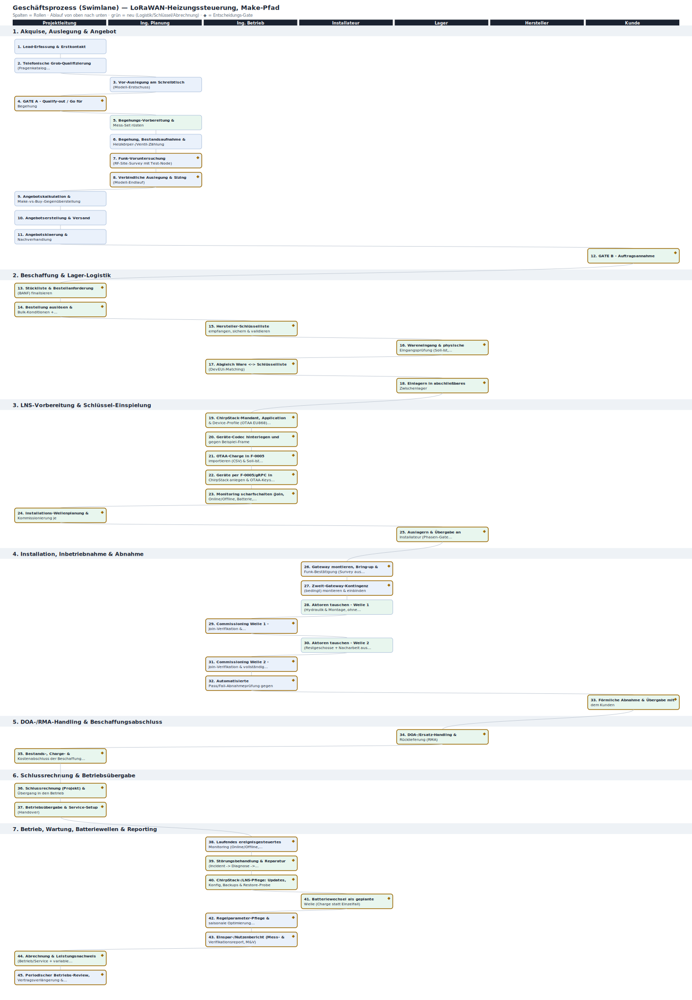

# Geschäftsprozessmodell — LoRaWAN-Heizungssteuerung (Make-Pfad)

> Vollständiger End-to-End-Prozess des virtuellen Betriebs — von der Anfrage bis zum laufenden Betrieb, inklusive der zuvor fehlenden Teile: Beschaffung, Hersteller-Schlüsselliste, Wareneingang, Ein-/Auslagern, Kommissionieren und Abrechnung. Visualisierung: 

## Rollen (Swimlanes)

- **Projektleitung (Vertrieb/PM)**
- **Ingenieur (Planung)**
- **Ingenieur (Betrieb)**
- **Installateur**
- **Lager / Materialdisposition**
- **Hersteller / Distributor**
- **Kunde**

## 1. Akquise, Auslegung & Angebot

| # | Schritt | Rolle | Artefakt | Gate |
|---|---|---|---|---|
| P1-01 | Lead-Erfassung & Erstkontakt | Projektleitung (Vertrieb/PM) | CRM-Lead-Datensatz; Eingangsbestätigung (Mail-Template) | — |
| P1-02 | Telefonische Grob-Qualifizierung (Fragenkatalog Schreibtisch-Teil) | Projektleitung (Vertrieb/PM) | Ausgefuellter Fragenkatalog (Schreibtisch-Spalte); Lead-Notiz | — |
| P1-03 | Vor-Auslegung am Schreibtisch (Modell-Erstschuss) | Ingenieur (Planung) | Vorkalkulations-Blatt (Modell-Lauf); Zweit-Gateway-Risiko-Notiz | — |
| P1-04 | GATE A - Qualify-out / Go für Begehung | Projektleitung (Vertrieb/PM) | Gate-A-Entscheidnotiz; Begehungsvereinbarung; ggf. Absage-Schreiben | Abbruch-Gate: Payback > Horizont bei guenstigsten Annahmen, Split-Incentive ohne Investitionswillen, oder Auflagen verbieten Geräte -> Stopp; sonst Go (auch 'Buy statt Make' ist legitimer Ausgang) |
| P1-05 | Begehungs-Vorbereitung & Mess-Set rüsten | Ingenieur (Planung) | Kommissionierliste Begehungs-Set; Mess-/Validierungsplan; Leih-/Entnahmebeleg (Lager) | — |
| P1-06 | Begehung, Bestandsaufnahme & Heizkörper-/Ventil-Zählung | Ingenieur (Planung) | Begehungsprotokoll (Fotos, Zählung, Grundriss-Skizze); vor-Ort-Teil Fragenkatalog; Mangelliste | — |
| P1-07 | Funk-Voruntersuchung (RF-Site-Survey mit Test-Node) | Ingenieur (Planung) | RF-Survey-Report (Messreihe/Heatmap je Etage); Sizing-Befund 'Gateways = N' | Sizing-Gate: Reicht die Funkreserve im langsamsten Modus (SF12)? Nein -> Zweit-Gateway oder externe Antenne als verbindliche Angebotsposition |
| P1-08 | Verbindliche Auslegung & Sizing (Modell-Endlauf) | Ingenieur (Planung) | Verbindliche BOM (mengen-/typgenau); Sizing-Dokument; Wirtschaftlichkeits-Endkalkulation; Kostensatz->Verkaufssatz-Blatt | Wirtschaftlichkeits-Gate (intern): Payback <= Horizont mit Ist-Daten? Grenzwertig -> Optionen ausweisen (Abgleich, Teil-Rollout) |
| P1-09 | Angebotskalkulation & Make-vs-Buy-Gegenüberstellung | Projektleitung (Vertrieb/PM) | Angebotskalkulation (intern); Make-vs-Buy-Vergleichsblatt; Optionsliste | — |
| P1-10 | Angebotserstellung & Versand | Projektleitung (Vertrieb/PM) | Angebotsdokument (PDF, Leistungsverzeichnis); Anschreiben; CRM-Status 'Angebot raus' | — |
| P1-11 | Angebotsklaerung & Nachverhandlung | Projektleitung (Vertrieb/PM) | Revidiertes Angebot (V2 falls noetig); Verhandlungsnotiz | — |
| P1-12 | GATE B - Auftragsannahme | Kunde | Unterschriebener Auftrag/Werkvertrag; eingefrorene BOM (Beschaffungsfreigabe); Liefer-/Installationsplan; Auftrags-Datensatz (ERP); Anzahlung ausgelöst | Auftrags-Gate (Definition of Ready für Beschaffung): Ohne unterschriebenen Auftrag + eingefrorene BOM keine Hardware-Bestellung |

## 2. Beschaffung & Lager-Logistik

| # | Schritt | Rolle | Artefakt | Gate |
|---|---|---|---|---|
| P2-01 | Stückliste & Bestellanforderung (BANF) finalisieren | Projektleitung (Vertrieb/PM) | Stückliste (BOM); BANF; Ersatzteil-/Pufferkalkulation (DOA 2-3 %) | Zweit-Gateway bestellen? Survey-getriggert (Fragenkatalog F7/F8); bei Unterabdeckung als ausloesbare Position mitbestellen |
| P2-02 | Bestellung auslösen & Bulk-Konditionen + Schlüssellisten-Lieferform vereinbaren | Projektleitung (Vertrieb/PM) | Purchase Order; Auftragsbestätigung (Liefertermin); Konditionsvereinbarung; zugesichertes Format/Zeitpunkt der Schlüsselliste | Mengenrabattschwelle erreicht (120+ Stk Bulk)? UND: Liefervariante der OTAA-Schlüsselliste festlegen -- (a) vorab als CSV (ideal, entkoppelt LNS-Vorbereitung von der Lieferung), (b) mit der Ware, (c) nach Lieferung; (a) vertraglich zusichern |
| P2-03 | Hersteller-Schlüsselliste empfangen, sichern & validieren | Ingenieur (Betrieb) | Hersteller-Schlüsselliste (CSV) = DevEUI-Charge; Validierungsprotokoll (Format-/Dublettencheck); Secret-Ablage-Nachweis | Schlüsselliste vollständig, valide & sicher übertragen? Bei fehlerhaftem/unverschlüsseltem Versand -> Nachforderung beim Hersteller, Provisionierung blockiert |
| P2-04 | Wareneingang & physische Eingangsprüfung (Soll-Ist, Stichproben-Join) | Lager / Materialdisposition | Wareneingangsprotokoll; abgezeichneter Lieferschein; Mangel-/Transportschadensnotiz; Seriennummern-/DevEUI-Scanliste | Menge & Zustand korrekt? Fehlmenge/Beschaedigung -> Reklamation; DOA-Geräte -> DOA-Buchung (P2-09) |
| P2-05 | Abgleich Ware <-> Schlüsselliste (DevEUI-Matching) | Ingenieur (Betrieb) | Abgleichsprotokoll (DevEUI-Charge <-> Lieferung); Differenz-/Klärliste | Liste deckt gelieferte Ware vollständig? Diskrepanz -> Klärung mit Hersteller vor Provisionierung; nicht zuordenbare Geräte gesperrt |
| P2-06 | Einlagern in abschließbares Zwischenlager | Lager / Materialdisposition | Lagerbestandsliste/Inventar (Lagerplatz <-> DevEUI-Charge); separat ausgewiesener Spare-Pool | Abschliessbarer Lagerplatz verfügbar (Fragenkatalog E10)? Nein -> objektnahes Sicherungskonzept oder Just-in-time je Welle |

## 3. LNS-Vorbereitung & Schlüssel-Einspielung

| # | Schritt | Rolle | Artefakt | Gate |
|---|---|---|---|---|
| P3-01 | ChirpStack-Mandant, Application & Device-Profile (OTAA EU868) anlegen | Ingenieur (Betrieb) | ChirpStack-Konfig-Notiz (tenant_id/application_id/device_profile_id, Namenskonvention); Device-Profile-Definition | Profil-Parameter (Region EU868, MAC-Version, supports_otaa=true, Class A) gegen Aktor-Datenblatt plausibel? Nein -> korrigieren |
| P3-02 | Geräte-Codec hinterlegen und gegen Beispiel-Frame verifizieren | Ingenieur (Betrieb) | Codec (codecs/<modell>.js + *.test.js); Codec-Verifikationsnotiz | Codec dekodiert Beispiel-Frame zu erwarteten JSON-Feldern? Nein -> Codec anpassen, Unit-Tests grün; unbekanntes Modell -> Rücksprung in Direktiven-Lifecycle |
| P3-03 | OTAA-Charge in F-0005 importieren (CSV) & Soll-Ist gegen BOM prüfen | Ingenieur (Betrieb) | Import-CSV (Charge); F-0005-Import-Protokoll/Fehlerreport; DevEUI-Charge mit Application-/Profile-Zuordnung | Import 100 % valide (alle DevEUIs zugeordnet, AppKey-Format korrekt, keine Dubletten)? Nein -> CSV bereinigen; Voraussetzung: ABP-vs-OTAA-Luecke in F-0005 geschlossen |
| P3-04 | Geräte per F-0005/gRPC in ChirpStack anlegen & OTAA-Keys einspielen | Ingenieur (Betrieb) | ChirpStack-Geräteliste (Charge angelegt, is_disabled=false, noch ohne Join); F-0005-Provisioning-Lauf-Log; DevEUI<->Standort-Vorbelegung | Anzahl angelegter Devices == Soll-Stueckzahl und Stichprobe (DevEUI/AppKey/Profile) korrekt? Nein -> Lauf wiederholen/Diff bereinigen |
| P3-05 | Monitoring scharfschalten (Join, Online/Offline, Batterie, Uplink-Luecken) | Ingenieur (Betrieb) | Monitoring-/Alert-Konfiguration; Soll-Geräteliste als Abnahme-Referenz | Alle Regeln greifen am Testereignis (simulierter Join/Offline loest Alert aus)? Nein -> Schwellen/Subscription korrigieren |
| P3-06 | Installations-Wellenplanung & Kommissionierung je Gebäude/Etage | Projektleitung (Vertrieb/PM) | Wellenplan (Zwei-Wellen-Schema je Geschoss/Steigzone); Kommissionierliste/Pickliste je Welle (DevEUI -> Raum); leere Raum-Zuordnungsvorlage | Bestand reicht für die Welle inkl. Puffer? Sonst Nachschub/Teilwelle. Reicht 1 Gateway über alle Geschosse (Survey)? Unklar/Nein -> Zweit-Gateway-Kontingenz der Zone zuordnen |
| P3-07 | Auslagern & Übergabe an Installateur (Phasen-Gate LNS->Installation) | Lager / Materialdisposition | Auslagerungs-/Materialausgabebeleg; beschriftete Aktor-Sets je Welle (DevEUI am Gerät); quittierte Übergabe | PHASEN-GATE: LNS vorbereitet (Tenant/App/Profile/Codec), Charge als OTAA angelegt + Keys eingespielt, Monitoring scharf, Wellen kommissioniert? Nein -> offene Punkte schliessen; Ja -> Freigabe zur Installation |

## 4. Installation, Inbetriebnahme & Abnahme

| # | Schritt | Rolle | Artefakt | Gate |
|---|---|---|---|---|
| P4-01 | Gateway montieren, Bring-up & Funk-Bestätigung (Survey aus Telemetrie) | Installateur | Kerlink-Bring-up-Protokoll (ADR-0018); Coverage-Report (Bring-up-Telemetrie); Gateway-EUI-Eintrag | Decken alle Geschosse den geforderten Fade-Margin (~25,7 dB für 99 % PDR)? Nein -> Zweit-Gateway-Kontingenz (P4-02) auslösen |
| P4-02 | Zweit-Gateway-Kontingenz (bedingt) montieren & einbinden | Installateur | Nachtrags-Bring-up-Protokoll; aktualisierter Coverage-Report; Kontingenz-/Nachtragsposition (Kunden-Freigabe) | Kontingenz auslösen? Nur bei Unterabdeckung aus P4-01 -- sonst übersprungen; Auslousung erfordert Kunden-Freigabe der Nachtragsposition |
| P4-03 | Aktoren tauschen - Welle 1 (Hydraulik & Montage, ohne Funk-Wartezeit) | Installateur | Montage-Checkliste je Raum (DevEUI <-> Ist-Raum, Abweichungen); Raum-Zutrittsliste/Schlüsselquittung des Kunden | — |
| P4-04 | Commissioning Welle 1 - Join-Verifikation & Raumzuordnung (F-0005/ChirpStack) | Ingenieur (Betrieb) | Commissioning-Report Welle 1 (DevEUI, Join-Zeit, erste RSSI/SNR); aktualisierte F-0005-Zuordnung | Alle Welle-1-Geräte gejoint und im Fade-Margin? Nein -> First-time-right-Reserve: Restliste in Welle 2 nacharbeiten |
| P4-05 | Aktoren tauschen - Welle 2 (Restgeschosse + Nacharbeit aus Welle 1) | Installateur | Montage-Checkliste Welle 2; aktualisierte Schlüssel-/Zutrittsliste; dokumentierter Reserve-Ventil-Verbrauch | — |
| P4-06 | Commissioning Welle 2 - Join-Verifikation & vollständige Raumzuordnung | Ingenieur (Betrieb) | Commissioning-Report Welle 2; konsolidierte Geräte-Raum-Matrix (Single Source für die Abnahme) | 100 % der Geräte gejoint und korrekt zugeordnet? Nein -> Restliste vor Abnahme klaeren (max. 3 Runden, dann Eskalation) |
| P4-07 | Automatisierte Pass/Fail-Abnahmeprüfung gegen ChirpStack | Ingenieur (Betrieb) | Abnahme-Pruefreport (automatisiert, ChirpStack-Auszug als Evidenz); Mangelliste falls Fail | Gesamtanlage PASS (Abdeckung, Join, Zuordnung, Latenz im Sollbereich)? FAIL -> zurück in Nacharbeit (Antenne/Position/Zweit-Gateway), nicht abnehmen |
| P4-08 | Förmliche Abnahme & Übergabe mit dem Kunden | Kunde | Abnahmeprotokoll (Kunde + Ingenieur unterschrieben); Übergabe-/Einweisungsnachweis; Schlüssel-Rückgabequittung | Kunde nimmt ab (ggf. unter Vorbehalt offener Restmaengel)? Nein -> Restmaengel beheben, erneute Teilabnahme |

## 5. DOA-/RMA-Handling & Beschaffungsabschluss

| # | Schritt | Rolle | Artefakt | Gate |
|---|---|---|---|---|
| P5-01 | DOA-/Ersatz-Handling & Rücklieferung (RMA) | Lager / Materialdisposition | DOA-/RMA-Protokoll; Gewährleistungs-/Rücksendebeleg; Gutschrift; aktualisierte Lagerbestandsliste; gesperrte/ausgebuchte DevEUIs in ChirpStack | Spare-Puffer aufgebraucht? -> Nachbestellung (zurück zu P2-02). RMA innerhalb Gewährleistung? Gesperrte DevEUIs auch im LNS deaktivieren |
| P5-02 | Bestands-, Charge- & Kostenabschluss der Beschaffung (Drei-Wege-Abgleich) | Projektleitung (Vertrieb/PM) | Hersteller-Rechnung (Eingangsrechnung, geprüft); Charge-Dokumentation (DevEUI-Charge <-> Gebäude/Welle <-> Raeume); Material-Kostenaufstellung | Rechnung = Bestellung = Wareneingang (Drei-Wege-Abgleich)? Abweichung -> Klärung vor Zahlungsfreigabe |

## 6. Schlussrechnung & Betriebsübergabe

| # | Schritt | Rolle | Artefakt | Gate |
|---|---|---|---|---|
| P6-01 | Schlussrechnung (Projekt) & Übergang in den Betrieb | Projektleitung (Vertrieb/PM) | Schlussrechnung (inkl. ausgelöster Nachtragspositionen, Reserve-Verbrauch); Projekt-Abschluss-/Übergabedossier; Betriebs-/Wartungsplan | Abnahme erteilt (Definition of Done erreicht)? Ja -> Schlussrechnung; Nein -> keine Schlussrechnung, Restmaengel-Schleife |
| P6-02 | Betriebsübergabe & Service-Setup (Handover) | Projektleitung (Vertrieb/PM) | Anlagenstammblatt (Asset-Register: DevEUI-Charge, Raumzuordnung, Seriennummern, Batterietyp, Einbaudatum); Servicevertrag/SLA; Eskalations-/Kontaktliste; Betriebshandbuch-Eintrag | Übergabe-Freigabe: Abnahmeprotokoll vollständig & gegengezeichnet? Sonst Rücklauf in die Installationsphase (Maengelliste), kein Betriebsstart |

## 7. Betrieb, Wartung, Batteriewellen & Reporting

| # | Schritt | Rolle | Artefakt | Gate |
|---|---|---|---|---|
| P7-01 | Laufendes ereignisgesteuertes Monitoring (Online/Offline, Funkreserve, Akku-Telemetrie) | Ingenieur (Betrieb) | Alerting-Regelsatz/Monitoring-Konfiguration; Störungs-Ticket (bei Trigger); monatlicher Health-Kurzstatus; Akku-Restwert-Liste | Alert-Trigger: Aktor offline > Schwelle ODER Funkreserve unter Mindestmarge (SF12) ODER Akku-Restwert < Schwelle -> verzweigt nach P7-02 (Störung) bzw. speist P7-04 (Batteriewelle) |
| P7-02 | Störungsbehandlung & Reparatur (Incident -> Diagnose -> Behebung) | Ingenieur (Betrieb) | Störungs-Ticket mit Root-Cause; Tausch-/Reparaturnachweis; RMA-Beleg; aktualisierte DevEUI-/Schlüssel-Zuordnung; Lagerabbuchung Ersatz-Aktor | Diagnose-Gate: Remote loesbar (Rejoin/Reprovisioning via F-0005) -> ohne Vor-Ort-Einsatz schliessen; sonst Vor-Ort-Tausch (Installateur + Lager). Sekundaer: Defekt in Gewährleistung -> RMA, sonst kostenpflichtig |
| P7-03 | ChirpStack-/LNS-Pflege: Updates, Konfig, Backups & Restore-Probe | Ingenieur (Betrieb) | Backup-Set (versioniert, off-host, inkl. verschlüsselter Schlüsselliste/Session-Keys); Restore-Testprotokoll; Change-/Update-Log; Konfig-Snapshot (.env, region-toml) | Restore-Verifikation: Test-Wiederherstellung erfolgreich (Geräte + Schlüssel rejoinen)? Nein -> Backup-Strategie korrigieren. Update-Gate: sicherheitsrelevantes Update -> eingeplantes Wartungsfenster |
| P7-04 | Batteriewechsel als geplante Welle (Charge statt Einzelfall) | Installateur | Wartungs-/Wellenplan; Kommissionierliste (Batterien + Reserve-Aktoren); Zugangs-/Terminliste je Wohneinheit; Wechselprotokoll (DevEUI -> erledigt/Funktion ok); Lagerabbuchung Batterien | Wellen-Ausloese-Gate: Akku-Restwert-Cluster erreicht Schwelle ODER Intervall faellig -> Welle auslösen statt Einzeltausche; Bundling-Gate: anstehende Reparaturen + Inspektion in denselben Termin ziehen |
| P7-05 | Regelparameter-Pflege & saisonale Optimierung (Heizperiodenwechsel) | Ingenieur (Betrieb) | Konfigurationsaenderungs-Log (Regelparameter); saisonale Checkliste (Sommer-Abschaltung/Winter-Hochlauf); Kundenfreigabe für Komfortaenderungen | Saison-/Änderungs-Gate: Heizperiodenwechsel oder Kunden-Nutzungsaenderung -> Profile anpassen; Rebound-Gate: messbarer Komfort-Rebound -> mit Kunde Nachsteuerung abstimmen |
| P7-06 | Einspar-/Nutzenbericht (Mess- & Verifikationsreport, M&V) | Ingenieur (Betrieb) | Nutzen-/Einsparbericht (PDF) je Periode; M&V-Datenblatt (kWh/EUR, Bandbreite, Annahmen, Konfidenz); Verfügbarkeits-/Uptime-Report | Plausibilitaets-/Konsistenz-Gate: gemessene Einsparung im erwarteten Archetyp-Band (mit Rebound-Abschlag)? Ausreisser -> Datenprüfung/Diagnose vor Versand an Kunde |
| P7-07 | Abrechnung & Leistungsnachweis (Betrieb/Service + variable Posten) | Projektleitung (Vertrieb/PM) | Service-Rechnung (Grundgebuehr + variable Posten Material/Einsaetze, ggf. erfolgsabhaengiger Anteil); Leistungsnachweis/Taetigkeitsbericht; Nutzenbericht als Anlage; Zahlungseingangsbeleg | Abrechnungs-Gate: SLA erfuellt (Verfügbarkeit/Reaktionszeit) -> volle Service-Rate; verfehlt -> Gutschrift/Minderung. Erfolgsmodell-Gate (falls vereinbart): Einsparziel aus P7-06 erreicht -> erfolgsabhaengiger Anteil faellig |
| P7-08 | Periodischer Betriebs-Review, Vertragsverlängerung & Lessons-Learned | Projektleitung (Vertrieb/PM) | Betriebs-Review-Protokoll; aktualisierter/verlaengerter Vertrag; Maßnahmen-/Roadmap-Liste; Lessons-Learned-Notiz (reale Einsparquote zur Testbed-Kalibrierung, ADR-Anstoss) | Fortfuehrungs-Gate: Vertrag verlaengern / nachverhandeln / beenden -> dann Rückbau-/End-of-Life-Phase. Re-Investitions-Gate: Aktor-Lebensende naht -> Erneuerungsangebot |

## Schlüssel-Artefakte (Zeitpunkt & Herkunft)

| Artefakt | Wann | Herkunft |
|---|---|---|
| Hersteller-Schlüsselliste (DevEUI/JoinEUI/AppKey-CSV) = DevEUI-Charge | Bestellt/vereinbart bei P2-02 (Liefervariante a/b/c festgelegt); empfangen, gesichert & validiert bei P2-03; gegen die gelieferte Ware abgeglichen bei P2-05; per CSV in F-0005 importiert bei P3-03 und in ChirpStack eingespielt bei P3-04; in P7-03 verschlüsselt mitgesichert | Hersteller / Distributor (entsteht werkseitig je Aktor; jede Zeile = ein Gerät) |
| Verbindliche BOM / Stückliste (eingefroren) | Erstellt bei P1-08; bei Auftrag (GATE B, P1-12) eingefroren; zur BANF konkretisiert bei P2-01; Soll-Ist-Referenz in P2-04/P2-05 und P5-02 | Ingenieur (Planung), bestaetigt durch Kunde-Auftrag |
| RF-Survey-/Coverage-Report (Sizing 'Gateways = N') | Erstellt am Schreibtisch (Risiko-Hypothese P1-03) und vor Ort (P1-07); vor Ort gegen Bring-up-Telemetrie bestaetigt P4-01; steuert Zweit-Gateway-Kontingenz P2-01/P3-06/P4-02 | Ingenieur (Planung) / (Betrieb) aus Test-Node- und Gateway-Bring-up-Messung (ADR-0018) |
| Fragenkatalog (Schreibtisch- + vor-Ort-Teil) | Schreibtisch-Teil bei P1-02, vor-Ort-Teil vervollständigt bei P1-06; speist Auslegung P1-08 und Logistik-/Lagerentscheide (E10 -> P2-06) | Projektleitung (Vertrieb) + Ingenieur (Planung) |
| Geräte-Raum-Matrix (DevEUI <-> Raum/Heizkörper) | Vorbelegt im Plan bei P3-04/P3-06; vor Ort beim Tausch erfasst P4-03/P4-05; konsolidiert P4-06; Pass/Fail-Referenz P4-07; Single Source für Abnahme P4-08 und Stammblatt P6-02 | Installateur (Ist-Erfassung) + Ingenieur (Betrieb) (Konsolidierung in F-0005/ChirpStack) |
| Soll-Geräteliste / Monitoring-Referenz | Festgeschrieben bei P3-05; Pass/Fail-Referenz P4-07; Betriebsreferenz P7-01 | Ingenieur (Betrieb) |
| Abnahmeprotokoll (unterschrieben) | Erzeugt bei P4-08; Voraussetzung für Schlussrechnung P6-01 und Betriebsübergabe P6-02 | Kunde + Ingenieur |
| Charge-/Seriennummern-Dokumentation (Gewährleistungshistorie) | Abgeschlossen bei P5-02; genutzt für RMA P5-01/P7-02, Batteriewelle P7-04 und Bestandsfuehrung P7-01 | Lager / Materialdisposition + Projektleitung |
| Anlagenstammblatt (Asset-Register) | Angelegt bei P6-02; fortgeschrieben in allen Betriebsschritten P7-01..P7-08 | Projektleitung + Ingenieur (Betrieb) |
| Einspar-/Nutzenbericht (M&V) & Service-Rechnung | M&V-Bericht je Periode P7-06; verknuepft mit Service-Abrechnung P7-07; Grundlage des Reviews P7-08 | Ingenieur (Betrieb) (Analyse) + Projektleitung (Rechnung) |

## Neu gegenüber der bisherigen 8-Schritt-Kette

- GATE A - Qualify-out vor der Begehung (P1-04): expliziter Abbruchpunkt, in der 8-Schritt-Kette nicht vorhanden (Review-Befund zu Schritt 1)
- GATE B - Auftrags-Gate als Definition of Ready für die Beschaffung (P1-12): keine Hardware-Bestellung ohne unterschriebenen Auftrag + eingefrorene BOM
- Beschaffung/Logistik als eigene Phase statt im Sammelschritt 4: BANF (P2-01), Bestellung mit Bulk-Konditionen (P2-02), Einlagern (P2-06), Kommissionierung je Welle (P3-06/P3-07), Auslagern (P3-07)
- Key-Handling als durchgaengiger Strang: Liefervariante der Schlüsselliste vertraglich vereinbart (P2-02), Schlüsselliste empfangen/gesichert/validiert (P2-03), Ware<->Schlüssel-Abgleich (P2-05), CSV-Import in F-0005 + Einspielung in ChirpStack (P3-03/P3-04) -- in der alten Kette unter 'LNS-Vorbereitung' verdichtet
- Wareneingang & physische Eingangsprüfung mit Stichproben-Join (P2-04): DOA-Erkennung VOR der Installationswelle, fehlte in der 8-Schritt-Kette
- Ein-/Auslagern explizit modelliert (P2-06 Einlagern, P3-07 Auslagern & Übergabe an Installateur) mit Lagerplatz-Gate (Fragenkatalog E10)
- DOA-/Ersatz-/RMA-Schleife (P5-01) und 2-3 % Spare-Pool als Prozess statt ungeplanter Einzelbestellung
- Beschaffungsabschluss mit Drei-Wege-Abgleich (Rechnung=Bestellung=Wareneingang) und Charge-Historie (P5-02), fehlte komplett
- Schlussrechnung an die unterschriebene Abnahme gekoppelt (P6-01) -- Abrechnung fehlte in der 8-Schritt-Kette
- Betriebs-/Service-Abrechnung mit SLA-/Erfolgs-Gate (P7-07) als laufender, variabler Posten
- Einspar-/Nutzenbericht (M&V, P7-06) als witterungsbereinigter Band-Report -- zentral für Servicevertrag, in der alten Kette nicht enthalten
- Batteriewechsel als geplante Charge/Welle (P7-04) statt geglaetteter 228-EUR/a-Durchschnitt; Zugang zu Mieterraeumen als Engpass
- LNS-Pflege mit Backups inkl. Schlüssel/Session-Keys und Restore-Probe (P7-03); explizit, dass Hosting-Marginalkosten ~0 sind (Phantomzeile entfernt)
- Saisonale Regelparameter-Pflege (P7-05) als realer, einsparungswirksamer Posten
- Periodischer Betriebs-Review mit Rückkopplung der realen Einsparquote in die Archetyp-Kalibrierung des Modells (P7-08)
- Zwei-Wellen-Install + Skript-Commissioning gegen Class-A-Latenz, mit DevEUI<->Raum-Erfassung vor Ort (P4-03..P4-06) statt naivem sequentiellen Provisionieren
- Automatisierte Pass/Fail-Abnahme gegen ChirpStack getrennt von der förmlichen Kundenabnahme (P4-07 vs. P4-08); Schlüssel-/Zutritts-Handling über den Kunden als realer Schritt
- Zweit-Gateway als explizite, survey-gesteuerte Kontingenz statt stiller 0-EUR-Annahme (P2-01 bedingte Bestellung, P4-02 bedingte Montage)
