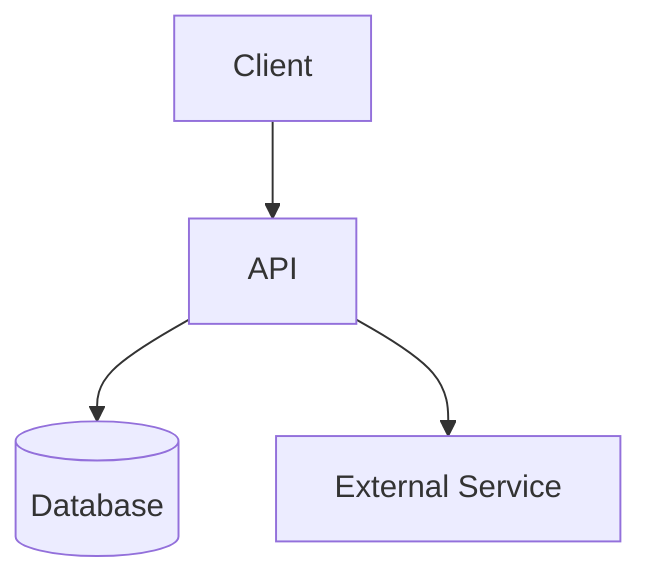

# System Design

> Fill in per project. Show structures as diagrams, not prose (see
> `CLAUDE.md`, core principles).

## Component Overview

```mermaid
graph TD
    A[Client] --> B[API]
    B --> C[(Database)]
    B --> D[External Service]
```

## Data Model

> Add an ER diagram per project.
