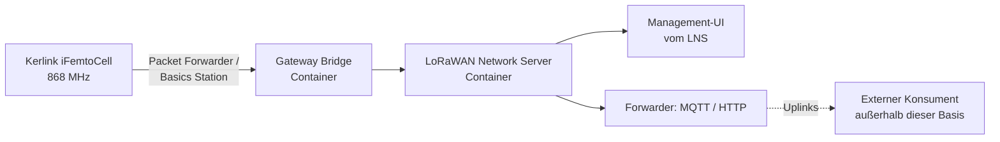
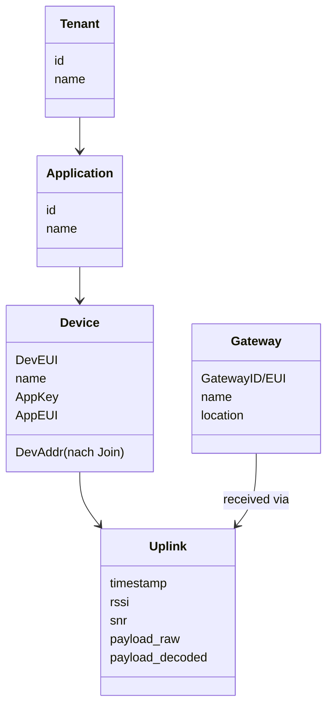
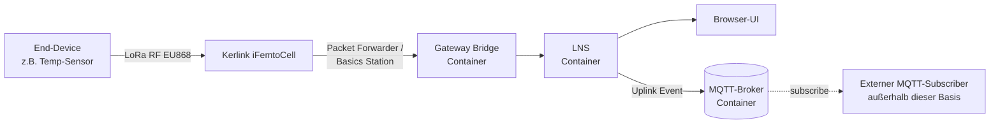

# Project Concept Paper

- Project: whz-lora
- Last updated: 2026-05-26
- Template version: <version>
- Onboarding status: complete

> This paper is the converged result of the onboarding interview (see
> `setup/interview.md`). The project space starts unbounded and is narrowed
> cluster by cluster until this paper is complete. While the status above
> is not `complete`, the onboarding runs or continues.
>
> Once `complete`, this paper records the project as defined at onboarding.
> The living sources of truth thereafter are the feature registry
> (`docs/developer/features.md`) for what the product does and the ADRs
> (`docs/developer/decisions/`) for decisions. Revise this paper via
> `/onboarding` when the project's foundation changes.

## 1. Foundation

**Project size**: Klein (single-host Docker-Compose-Stack, 1 Gateway zum
Start, einige Test-Devices, 1 Betreiber).

### Essenz

Selbst betriebene LoRaWAN-Basis an der Westsächsischen Hochschule Zwickau
(WHZ) als Datenquelle für Forschungs-Sensorik. Bündelt LoRaWAN Network
Server, Gateway-Bridge und Management-UI in einem Docker-Compose-Stack
auf Basis vorhandener Open-Source-Software. Daten bleiben on-premise im
Hochschulnetz.

### Problem

Eigene LoRaWAN-Sensoren in Forschungsvorhaben sollen ohne Abhängigkeit
von externen Netzen (TTN, kommerzielle Provider) betrieben werden; die
Daten müssen zuverlässig in der Hochschulinfrastruktur landen und an
Auswerteketten weiterleitbar sein.

### Erfolgskriterien

- Der Kerlink Wirnet iFemtoCell Evolution 868 (PDTIOT-IFE03) ist im LNS
  registriert; sein Status in der ChirpStack-UI ist `online`.
- Nach dem ersten Join eines Test-Sensors empfängt der LNS innerhalb von
  fünf Minuten mindestens einen Uplink-Frame, der in der UI sichtbar ist.
- Uplinks werden über den eingebetteten MQTT-Broker veröffentlicht und
  von einem Beispiel-Subscriber empfangen.
- Der gesamte Server-Stack lässt sich aus dem Repository mit
  `docker compose up` reproduzierbar starten; die ChirpStack-Web-UI ist
  unter `http://<host>:8080` erreichbar.

### Non-Goals

- Kein Multi-Tenant-Betrieb.
- Kein Roaming zu öffentlichen Netzen (TTN, Helium).
- Keine eigene Hardware-Entwicklung.
- Keine produktive SLA / kein 24/7-Betriebskonzept.
- Keine eigene Anwendungs-UI über die vom LNS mitgelieferte UI hinaus.
- Kein eigener Persistenz-Layer in dieser Iteration (LNS-interne
  Speicherung + Forwarding genügt).

### Scope & Constraints

- Ein einziges Repository (KISS, Größe Klein).
- Ein Compose-Stack auf einem Host.
- Docker pragmatisch — Server-Services in Containern, einzelne native
  Tools auf dem Host erlaubt, wenn ein Container unverhältnismäßig wäre.
- EU868-Funkbereich (Duty-Cycle-Vorschriften übernimmt der LNS).
- Keine harten Deadlines, kein festes Budget.
- Team: Product Owner + AI-Team (keine weiteren menschlichen Entwickler).

### Tech-Stack — Constraints

- Vorhandene Open-Source-Software bevorzugen, nicht selbst nachbauen.
- LNS muss Semtech UDP Packet Forwarder **oder** Basics Station sprechen
  (Kerlink-Kompatibilität).
- Konkrete LNS-Wahl (z.B. ChirpStack vs. The Things Stack Open Source) in
  Cluster D, Theme 20.

### Architektur (Skizze, vor LNS-Wahl)

### Core Features

Seeded für die Feature-Registry am Ende des Onboardings:

1. **Gateway-Anbindung** — Kerlink-Gateways sprechen mit dem LNS über
   Packet Forwarder oder Basics Station.
2. **Geräte-Verwaltung** — Web-UI (vom gewählten LNS), in der Gateways
   und End-Devices registriert und überwacht werden.
3. **Daten-Weiterleitung** — Uplinks werden über MQTT-Broker und/oder
   HTTP-Webhook an externe Konsumenten weitergereicht.
4. **Reproduzierbares Setup** — der gesamte Server-Stack wird als
   Docker-Compose im Repository versioniert und mit `docker compose up`
   gestartet.

## 2. Interfaces & Data

### Input

- **LoRaWAN-Uplinks** vom Kerlink iFemtoCell Evolution 868, übertragen
  via Semtech UDP Packet Forwarder oder Basics Station (genaue Brücke
  abhängig von der LNS-Wahl in Cluster D).
- **End-Devices**: in der ersten Iteration ausschließlich eigene
  Test-Devices, vom Product Owner angelegt. Forschungs- und Studierenden-
  Devices folgen später als eigene Direktiven.

### Output

- **MQTT-Topics** für externe Konsumenten — Subscribe auf
  Uplink-Events nach dem Standard-Schema des gewählten LNS
  (z.B. `application/{id}/device/{eui}/event/up`).
- **Browser-UI** des LNS für die Administration.
- *Keine* HTTP-Webhooks, *keine* eigene REST-API, *keine* eigene
  Anwendungs-UI in dieser Iteration.

### Payload-Decodierung

Pro Device wird im LNS ein Codec hinterlegt (JavaScript-Funktion bei
ChirpStack / TTS); MQTT-Konsumenten erhalten bereits dekodierte
JSON-Felder, keine Rohbytes.

### Datenmodell

Standard-LoRaWAN-Entitäten, vom LNS bereitgestellt:

### Datenfluss

### Datenverarbeitung & Analyse

- Decodierung Bytes → JSON-Felder im LNS pro Device-Profil.
- Keine eigene Aggregation, Statistik oder ML in dieser Basis — solche
  Auswertungen passieren beim Konsumenten (externer MQTT-Subscriber).

### Datenspeicherung

- LNS-intern: PostgreSQL (von ChirpStack v4 zwingend gefordert) für
  Devices, Konfiguration und einen rollierenden Uplink-Verlauf; Redis
  für Sessions und Caching — beide aus dem offiziellen
  `chirpstack-docker` Compose.
- Kein eigener Persistenz-Layer für Langzeitdaten in dieser Iteration.
- Backup-Strategie: Volume-Snapshots des PostgreSQL-Containers reichen
  für die erste Iteration; eine produktive Backup-Routine ist Out of
  Scope.

## 3. Operations & Quality

### Users & Access

- **Menschliche Nutzer**: ausschließlich der Product Owner als Admin der
  LNS-UI und des Compose-Stacks. Login mit Mosquitto-Username/Passwort
  und ChirpStack-eigenem Admin-Account.
- **Maschinen**: ein oder mehrere externe MQTT-Subscriber (Forscher-
  Skripte). Auth via Mosquitto-Username/Passwort gegen den eingebetteten
  Mosquitto-Broker; anonyme Verbindungen sind deaktiviert
  (`allow_anonymous false` in der Mosquitto-Konfiguration). Credentials
  werden pro Subscriber-Identität in `mosquitto/passwd` gepflegt; ACLs
  schränken die abonnierbaren Topics ein.
- **Tenancy**: Single-Tenant — nur der vorgegebene Default-Tenant in
  ChirpStack wird genutzt.

### Non-Functional Requirements

- Last in der ersten Iteration: ein Gateway, eigene Test-Devices,
  < 100 Uplinks/Tag.
- Latenz: unkritisch (Uplink → MQTT-Subscriber im Sekundenbereich).
- Verfügbarkeit: best-effort. Kein 24/7-Anspruch, kein SLA.

### Security & Privacy

- Keine personenbezogenen Daten in Uplinks (Sensoren sind technisch /
  umweltbezogen). Datenschutz-Folgenabschätzung daher nicht relevant —
  ändert sich, wenn das später nicht mehr stimmt.
- LoRaWAN-Schicht: Standard-Crypto (AppKey, NwkKey, OTAA), vom LNS
  verwaltet.
- Backhaul Kerlink → LNS: bevorzugt Basics Station mit TLS; UDP Packet
  Forwarder akzeptabel solange beide Endpunkte im Hochschulnetz liegen.
- Secrets (DB-Passwort, MQTT-Credentials, API-Tokens) ausschließlich
  über `.env`-Datei und Compose-`environment` — niemals im Repository.
- Zugriff auf die LNS-UI nur aus dem WHZ-Netz oder über VPN
  (Verantwortung des Hostings, nicht des Stacks selbst).

### Quality & Testing

- **Artefakt-Typ**: Service (Docker-Compose).
- **Verifikationscheck** (CLAUDE.md → Testing): Compose-Stack hochfahren
  → ChirpStack-gRPC-API auf `:8080` ist erreichbar (Health-Endpoint
  existiert in ChirpStack v4 nicht) → Mosquitto auf `:1883` akzeptiert
  authentifizierte Verbindungen → das Smoke-Test-Skript provisioniert
  per gRPC einen Test-Tenant + Application + Device-Profile + Device →
  speist über UDP-Port 1700 (Packet Forwarder Protocol) einen
  synthetischen Uplink als virtuelles Gateway ein → ein MQTT-Subscriber
  auf `application/<id>/device/<eui>/event/up` empfängt diesen Uplink
  innerhalb von 30 Sekunden.
- **Verifikations-Tooling**: ein selbst gebautes Smoke-Test-Skript in
  **Python**, das die offizielle `chirpstack-api`-Bibliothek (gRPC) für
  Provisionierung und einen UDP-Socket für den Frame-Inject nutzt.
  `brocaar/chirpstack-simulator` wird *nicht* genutzt (Repo seit
  November 2023 ohne Commits, Wartungsrisiko); Details siehe ADR-0015.
- **Test-Levels** in dieser Iteration:
  - **Unit** — JavaScript-Codecs unter `codecs/` werden mit `node --test`
    geprüft, sobald der erste Codec existiert (Bytes-zu-JSON-Mapping ist
    der klassische Unit-Test-Fall). Verbindlich von F-0002 an.
  - **Integration** — vollständiger Compose-Stack-Hochlauf in CI mit dem
    Python-Smoke-Test als End-to-End-Lauf.
  - Kein automatisiertes End-to-End mit echter Funk-Strecke; eine
    manuelle Release-Checkliste deckt das ab.
- **Verifikationsplattform**: Referenz ist der Linux-Runner in GitHub
  Actions (Ubuntu). Lokale Entwicklung auf Windows/Docker Desktop muss
  funktionieren, ist aber nicht der kanonische Testpfad — das
  Smoke-Test-Skript ist plattformneutral (Python 3.12+).
- **Tooling**: Docker, Compose, Python 3.12+, `chirpstack-api`,
  `paho-mqtt`. Lint kommt für jede Sprache hinzu, sobald entsprechender
  Code entsteht (Codecs: `node --test`; Python-Skripte: `ruff`).
- **CI**: GitHub Actions Job mit `timeout-minutes: 10`, Stack-Hochlauf,
  Smoke-Test-Lauf, Logs-bei-Fehler, `docker compose down -v` im
  Teardown. `paths-ignore` für reine Doku-Änderungen.

### Deployment & Environments

- **Umgebung**: ein lokaler Entwickler-Host (Windows mit Docker Desktop)
  in der ersten Iteration. Compose-Datei ist portabel; Umzug auf eine
  WHZ-Lab-VM später ist kein Neubau.
- **CI/CD-Ziel**: kein automatischer Push zu Produktion. CI = GitHub
  Actions, das Tests und Verifikationscheck auf jedem PR laufen lässt.
- **Releases**: Git-Tags, semantische Versionierung. Eine Release-
  Walkthrough-Prüfung (CLAUDE.md → Releases) gegen die User-Doku
  bestätigt, dass ein Fremder den Stack mit der Doku hochbekommt.

## 4. Infrastructure, Risks & Decisions

### Infrastructure Needs

- Docker / Docker Compose lokal auf dem Entwickler-Host.
- GitHub-Repository als Remote (Code, Issues, CI). Wird in Onboarding
  Step 7 angelegt.
- HTTP/SSH-Zugriff auf den Kerlink iFemtoCell zur Erstkonfiguration —
  keine Komponente des Stacks selbst, sondern Doku-Sache.

### Documentation Audiences

- **Developer-Doku** (`docs/developer/`, `mkdocs.developer.yml`):
  Sprache **Englisch**. Audience: Mitwirkende am Repository.
- **User-Doku** (`docs/user/`, `mkdocs.user.yml`):
  Sprache **Englisch**. Audience: WHZ-interne Betreiber und externe
  Konsumenten der MQTT-Schnittstelle.

User-Doku muss durchgängig vier Pfade abdecken (Release-Walkthrough-Test):

1. Den Stack mit Docker Compose aus dem Repository hochfahren.
2. Den Kerlink iFemtoCell so konfigurieren, dass er auf den eigenen LNS
   zeigt (Packet Forwarder oder Basics Station).
3. Im LNS ein End-Device anlegen, OTAA-Keys vergeben, einen Codec
   hinterlegen.
4. Einen MQTT-Subscriber anschließen und Uplinks empfangen.

### Risks & Unknowns

Keine ausführliche Risikoliste — KISS. Risiken werden in der Direktiven-
Pipeline aufgenommen, wenn sie konkret auftreten. Zwei aus dem
Concept Audit (siehe ADR-0015) verbleibende Vorbehalte werden hier
explizit festgehalten, weil sie die erste Direktive direkt betreffen:

- **Kerlink iFemtoCell *Evolution* (PDTIOT-IFE03) und ChirpStack
  Concentratord**: Die offizielle ChirpStack-Doku adressiert das Basis-
  iFemtoCell und das Paket
  `chirpstack-concentratord_4.7.1-r1_klkgw.ipk`, nennt das
  Evolution-Modell aber nicht namentlich. Die Kompatibilität ist erst
  beim ersten realen Flash zu bestätigen. Mitigation: erste F-0001-
  Direktive enthält einen frühen Hardware-Check; Fallback ist der
  klassische Semtech UDP Packet Forwarder.
- **`brocaar/chirpstack-simulator` ist eingefroren**: deshalb wird er
  *nicht* eingesetzt; siehe ADR-0015 für die Alternative.

### Chosen Tech Stack

**ChirpStack v4** als LoRaWAN Network Server. Evaluation im Onboarding,
Theme 20, gegen The Things Stack Open Source. Ausschlag gaben:

- Out-of-the-box Docker-Compose-Setup für `localhost` ohne TLS-Vorlauf.
- Dediziertes Kerlink-iFemtoCell-`.ipk`-Paket plus explizite Doku.
- Einfache MQTT-Integration (eingebetteter Mosquitto, Standard-Topic-
  Schema, kein API-Key-Zwang).
- Verfügbarer Gateway-Simulator passend zum Verifikationscheck.
- Größeres Recherche-Material für Modell + research-Agent.

Wird als ADR `docs/developer/decisions/0001-lns-stack-chirpstack-v4.md`
festgehalten.

### Accepted Setup Recommendations

**MCP-Server** (Theme 21):

- `browser` (Playwright) — bleibt aktiv (vom Template gesetzt). Nutzt
  primär der `research`-Agent.
- `postgres` — neu aufnehmen. Erlaubt research/reviewer, das ChirpStack-
  Schema direkt zu inspizieren, sobald der Stack läuft. Verbindungs-URI
  via `.env`.

**Skills**: keine projektspezifische Skill zusätzlich nötig. Die
Template-Skills (feature, verify, run, review, ...) genügen.

**Manuell zu installierende Tools** (PO-Checkliste):

- Docker Desktop für Windows
- `gh` CLI
- Python + `pip install -r requirements.txt` für die mkdocs-Sites

**Build-it-ourselves** — als spätere Direktiven nach Repo-Erstellung
vorzumerken:

1. ChirpStack-Provisioning-Skript: Devices und Gateways via gRPC-API
   reproduzierbar anlegen (statt UI-Klicks). Sinnvoll, sobald mehr als
   2–3 Devices.
2. Custom ChirpStack-MCP-Bridge: optional, nur falls die `postgres`-MCP
   für Lese-Zugriffe nicht ausreicht.

### Team-Tuning

Basis-Team unverändert (spec-analyst, implementer, reviewer, research) —
ein Spezialist erfüllt aktuell keine der drei Aufnahmekriterien
(wiederkehrend, eigenständige Kompetenz, persistent besser).

Leichte, projektspezifische Hinweise in den Agent-Dateien:

- **reviewer**: LoRaWAN-typische Risiken im Blick haben (Funk-Frequenz
  EU868 nicht hartcodieren, OTAA-Keys gehören in `.env`, MQTT-ACLs für
  externe Subscriber prüfen).
- **implementer**: Eigener Code-Anteil ist klein — Schwerpunkt liegt auf
  Docker-Compose, `.env`, Codec-JavaScript und Smoke-Test-Skript.
- **research**: Primärquellen sind ChirpStack-Doku, ChirpStack-Forum,
  GitHub-Issues; Kerlink-Wiki für Gateway-Konfiguration.
