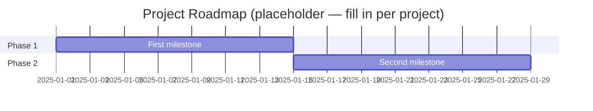

# Project Plan

Timeline as a Gantt diagram. Replace the placeholder below with the real
roadmap during or after onboarding.

```mermaid
gantt
    title Project Roadmap (placeholder — fill in per project)
    dateFormat YYYY-MM-DD
    section Phase 1
    First milestone     :m1, 2025-01-01, 14d
    section Phase 2
    Second milestone    :m2, after m1, 14d
```
