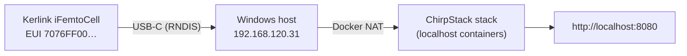

# Bringing a Kerlink Wirnet iFemtoCell Evolution online

How to connect a Kerlink Wirnet™ iFemtoCell-evolution 868 (model
`PDTIOT-IFE03`) to a fresh whz-lora ChirpStack stack running on a
Windows host with Docker Desktop.

Tested on KerOS 6.3.0 (demetra), May 2026. The procedure works the
same on KerOS 6.4.x.

## What you need

| Item | Notes |
|---|---|
| Kerlink Wirnet iFemtoCell-evolution 868 (`PDTIOT-IFE03`) | EU868 hardware variant |
| USB-C data cable | Connects the gateway to your PC. The same cable also powers the gateway, no separate power supply needed for bring-up. |
| Windows host | Tested on Windows 11, with Docker Desktop and Python 3.12+ already installed (see [Stack bring-up](getting-started.md)). |
| Admin privileges on the Windows host | One-time, to add two firewall rules. |
| Web browser | For the ChirpStack management UI and the Kerlink admin UI. |

## Overview



The gateway exposes a USB-Ethernet (RNDIS) interface to the PC.  The
PC and the gateway are in the same `192.168.120.0/24` subnet — gateway
at `.1`, PC at `.31`.  All gateway management (web UI, SSH) and the
LoRa packet-forwarder traffic (UDP/1700) flow over this USB link; no
LAN, Wi-Fi or cellular needed for the bring-up.

## Step 1 — Plug the gateway into the PC

USB-C cable into the gateway's USB-C port, USB-A end into the PC.

Windows recognises a *Remote NDIS Compatible Device* and brings up a
new network adapter (typically `Ethernet 3` or similar).  Verify in
**PowerShell**:

```powershell
Get-NetIPConfiguration | Where-Object { $_.InterfaceDescription -match 'Remote NDIS' }
```

Expected output:

```
InterfaceAlias       : Ethernet 3
IPv4Address          : 192.168.120.31/24
IPv4DefaultGateway   : 192.168.120.1
```

If you don't see a Remote NDIS adapter at all, give Windows 10–20
seconds and check again — driver enumeration takes a moment on first
plug.

## Step 2 — Open the Windows firewall for LoRa traffic

The gateway speaks the Semtech UDP Packet Forwarder protocol on
port 1700/UDP.  Windows blocks that direction by default on the USB
adapter (it's classified `Public`).  We add two inbound rules in an
**Administrator PowerShell** (Start → Windows PowerShell → right-click
→ *Als Administrator ausführen*):

```powershell
New-NetFirewallRule -DisplayName "whz-lora UDP 1700" `
                    -Direction Inbound -Action Allow `
                    -Protocol UDP -LocalPort 1700 -Profile Any -Enabled True

New-NetFirewallRule -DisplayName "whz-lora ICMPv4" `
                    -Direction Inbound -Action Allow `
                    -Protocol ICMPv4 -Profile Any -Enabled True
```

The ICMP rule is for diagnostic `ping` — not strictly required for
operation, but useful when something goes wrong.

These rules are persistent across reboots.  You don't need to repeat
this step for the same PC ever again, but every fresh Windows host
that hosts the ChirpStack stack needs them once.

## Step 3 — Reach the Kerlink web UI

Open `http://192.168.120.1` in a browser.  KerOS 6 ships with the
*Cockpit*-based admin UI:

- **Login**: `admin`
- **Default password**: `pwd4admin` (or whatever your unit shipped
  with — KerOS 6.4+ ships per-device factory passwords printed on the
  device label)

On first login the UI forces a password change.  Choose one and note
it — it doubles as the `sudo` password for the `admin` Linux account
on the gateway.

If the unit is second-hand or pre-configured by someone else and the
admin password is unknown:

1. Click your username (top-right) → log out.
2. From a fresh browser tab go to `http://192.168.120.1` again.
3. On the login screen there is a *Reset to factory configuration*
   link.  Use it.  The gateway reboots into KerOS defaults
   (~2 minutes).  Re-login as `admin` / `pwd4admin`.

This *Web-UI factory reset* is the cleanest reset path.  The
hardware-button sequence on the iFemtoCell-evolution (hold WPS during
boot) only restores to the *currently installed* stock image, which
may be a hardened previous-tenant variant — see [ADR-0018](../developer/decisions/adr-0018.md)
for the analysis.

## Step 4 — SSH access without typing the password every time

KerOS 6 disables SSH-as-root by design.  You log in as `admin` and
use `sudo` when you need root.  Password auth for SSH is also off —
you have to install a public key.

### 4a — Generate a key on the PC (PowerShell)

```powershell
ssh-keygen -t ed25519 -f $env:USERPROFILE\.ssh\kerlink_admin -N '""' -C "kerlink-admin"
Get-Content $env:USERPROFILE\.ssh\kerlink_admin.pub
```

Copy the printed public-key line (one line, starts with `ssh-ed25519`).

### 4b — Install it on the gateway via the web UI

In the Kerlink web UI:

1. Sidebar → **Konten** (Accounts)
2. Click the `admin` account
3. Add the public key you copied
4. Save

**Important**: Cockpit *manages* `~/.ssh/authorized_keys` for the
admin account.  If you previously added a key directly in the
terminal with `echo … >> ~/.ssh/authorized_keys`, Cockpit will
silently overwrite it with whatever the UI has on file.  Always edit
keys through the UI.

### 4c — Add a convenience entry in `~/.ssh/config` on the PC

This makes `ssh kerlink` work everywhere on your PC:

Create or append to `C:\Users\<you>\.ssh\config`:

```
Host kerlink
    HostName 192.168.120.1
    User admin
    IdentityFile C:\Users\<you>\.ssh\kerlink_admin
    StrictHostKeyChecking accept-new
    ServerAliveInterval 30
```

Verify:

```powershell
ssh kerlink "uname -a; cat /etc/os-release | head -3"
```

You should see the gateway hostname (`klk-fevo-XXXXXX`) and KerOS
version.

## Step 5 — Point the packet forwarder at the local ChirpStack stack

The gateway's LoRa packet forwarder (`lorafwd`) ships configured for
`localhost` — i.e. it does nothing.  We point it at the PC's USB-side
IP (`192.168.120.31`) so frames flow into the Docker-hosted
chirpstack-gateway-bridge container.

From the PC, in any normal PowerShell:

```powershell
ssh kerlink "sudo sed -i 's|^#node = \"localhost\"|node = \"192.168.120.31\"|' /etc/lorafwd.toml"
ssh kerlink "grep '^node' /etc/lorafwd.toml"
```

You will be prompted for the `admin` user's password (which is the
same as the web UI login password).  Expected output of the second
command:

```
node = "192.168.120.31"
```

Then restart the service:

```powershell
ssh kerlink "sudo systemctl restart lorafwd"
ssh kerlink "sudo journalctl -u lorafwd -n 10 --no-pager"
```

The journal should show a fresh start, no errors.

## Step 6 — Verify on the host side

Bring the whz-lora stack up if it isn't already:

```powershell
cd C:\Users\<you>\Projekte\whz-lora
Copy-Item .env.example .env -Force
docker compose up -d --wait
```

Then watch the gateway-bridge container — within 30 seconds you
should see the first stats frame from the real Kerlink:

```powershell
docker compose logs chirpstack-gateway-bridge --tail 20
```

Expected lines (excerpt):

```
backend/semtechudp: starting gateway udp listener  addr="0.0.0.0:1700"
integration/mqtt: connected to mqtt broker
integration/mqtt: subscribing to topic  topic="eu868/gateway/7076ff00…/command/#"
integration/mqtt: publishing state  gateway_id=7076ff00…  state=conn
integration/mqtt: publishing event  event=stats  topic=eu868/gateway/7076ff00…/event/stats
```

The `gateway_id` is your gateway's EUI (16 hex chars, printed on the
device label, starts `7076ff00…`).

## Step 7 — Register the gateway in ChirpStack

Until the gateway is in the ChirpStack database, its stats frames
arrive but are dropped with `Object does not exist`.  Two ways to
register it:

### Option A — Web UI

1. Open `http://localhost:8080`
2. Login `admin` / `admin` (KerOS 6 default for a freshly-flashed
   ChirpStack stack; the first login may force a password change)
3. Tenants → click the default tenant → **Gateways** → **+ Add Gateway**
4. Fill in:
   - **Gateway ID**: the 16-hex EUI from the device label
     (e.g. `7076FF0064071A3D`)
   - **Name**: anything (e.g. `whz-kerlink-ifevo`)
   - **Region**: `eu868`
   - **Stats interval**: 30

### Option B — Script (one-shot)

The repository ships a Python helper for this; see
[`scripts/`](../../scripts/).  After
the smoke-test requirements are installed (`pip install -r
scripts/requirements-test.txt`):

```python
# Adapt the gateway EUI to your unit before running.
python -c "
import grpc
from chirpstack_api.api import (internal_pb2, internal_pb2_grpc,
                                 tenant_pb2, tenant_pb2_grpc,
                                 gateway_pb2, gateway_pb2_grpc)
GW = '7076FF0064071A3D'.lower()
ch = grpc.insecure_channel('localhost:8080')
jwt = internal_pb2_grpc.InternalServiceStub(ch).Login(
    internal_pb2.LoginRequest(email='admin', password='admin')).jwt
meta = [('authorization', f'Bearer {jwt}')]
t = tenant_pb2_grpc.TenantServiceStub(ch).List(
    tenant_pb2.ListTenantsRequest(limit=100), metadata=meta).result[0].id
gateway_pb2_grpc.GatewayServiceStub(ch).Create(
    gateway_pb2.CreateGatewayRequest(gateway=gateway_pb2.Gateway(
        gateway_id=GW, name='whz-kerlink-ifevo',
        description='Kerlink iFemtoCell Evolution 868',
        tenant_id=t, stats_interval=30)),
    metadata=meta)
print(f'OK: {GW}')
"
```

## Step 8 — Confirm in the ChirpStack UI

Refresh the *Gateways* page.  The gateway should show:

- A green status indicator
- `Last seen` value within the last 30 seconds
- A *Live frames* tab that lights up every 30 seconds

Live LoRa events arrive here when an end device transmits.

## Troubleshooting

### `chirpstack-gateway-bridge` log is silent — no stats frames

The pipeline is **gateway → USB → Windows → Docker → bridge**.  Walk
backwards:

1. `ssh kerlink ping -c2 192.168.120.31` — if this fails, the
   Windows firewall is blocking ICMP (Step 2 incomplete) or the USB
   adapter isn't up.
2. `ssh kerlink "sudo systemctl status lorafwd"` — if not active or
   logs show a config error, re-check Step 5.
3. `ssh kerlink "grep '^node' /etc/lorafwd.toml"` — must read
   `node = "192.168.120.31"`; if empty, Step 5 didn't apply.

### ChirpStack logs say `Update gateway state: Object does not exist`

The gateway is publishing stats but it isn't registered.  Do Step 7.

### `mosquitto` container restart-loops with `exec: no such file or directory`

The `mosquitto/entrypoint.sh` was checked out with CRLF line endings.
The repository ships a `.gitattributes` that prevents this, but if
you cloned before the fix:

```powershell
cd C:\Users\<you>\Projekte\whz-lora
git rm --cached mosquitto/entrypoint.sh postgresql/initdb/001-chirpstack_extensions.sh
git checkout -- mosquitto/entrypoint.sh postgresql/initdb/001-chirpstack_extensions.sh
docker compose down -v
docker compose up -d --wait
```

### Postgres log says `Database directory appears to contain a database; Skipping initialization`

A previous volume survived.  `docker compose down -v` wipes the
named volumes; if even that doesn't help, `docker volume ls` and
`docker volume rm whz-lora_postgresqldata` explicitly.

### `ssh kerlink` returns `Permission denied (publickey)` after working before

KerOS 6 / Cockpit re-syncs `~/.ssh/authorized_keys` from its own
store.  If anyone (or any script) edited the file outside the web UI,
Cockpit will overwrite it.  Re-add the key through *Konten* in the
web UI.

## Beyond bring-up

Once the gateway is online, the next milestone is the first real
end-device uplink.  For first-test sensors at this scale we recommend
the Dragino LHT52 (~21 € net at exp-tech.de) — official ChirpStack-v4
codec on
[github.com/dragino/dragino-end-node-decoder](https://github.com/dragino/dragino-end-node-decoder).
OTAA keys are printed on the device label; provisioning takes about
five minutes through the ChirpStack web UI.
