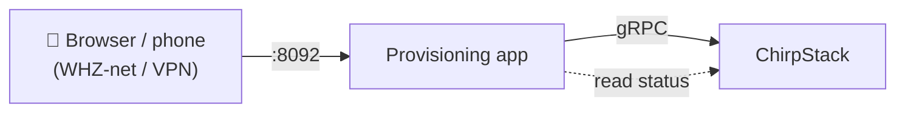

# Provisioning actuators

The **provisioning app** lets you enrol LoRaWAN actuators (Stellantriebe) onto
the stack without clicking through the raw ChirpStack admin UI, and tells you
whether each device has actually come online. It is built for the recurring
problem that long DevEUI/AppKey strings get mistyped and a device silently never
joins.

It runs as part of the Docker Compose stack on the host port **`:8092`** and is
reachable only inside the WHZ network / VPN — the same boundary as the ChirpStack
UI on `:8080`. There is no separate sign-up; see [Access and security](#access-and-security).



## What you need per actuator

LoRaWAN OTAA devices ship with three credentials:

| Field | Where it comes from | Notes |
|---|---|---|
| **DevEUI** | Printed on the device label / QR code | 16 hex characters |
| **JoinEUI** (AppEUI) | Label / vendor sheet | 16 hex characters; often a fixed vendor value. May be left blank → all zeros |
| **AppKey** | **Vendor CSV or e-mail — not on the label** | 32 hex characters; this is the secret |

The **AppKey is never printed on the device**. Vendors deliver it separately
(a CSV file or a secure e-mail) for security reasons. Keep that file handy — it
is what you enter or upload.

## Enrol a single device

1. Open `http://<host>:8092/` in your browser.
2. Fill in a **name** (e.g. `Heizung-Raum-101`), the **DevEUI**, optionally the
   **JoinEUI**, and the **AppKey**.
3. Submit. The app creates the device and its OTAA keys in ChirpStack and tells
   you it is ready to join.

Spaces, colons and dashes in the hex fields are ignored, so you can paste values
in whatever format the vendor sheet uses.

## Enrol many devices (CSV bulk import)

Prepare a CSV with **one row per device** and a header row. Column order does not
matter; only `dev_eui` and `app_key` are required.

```csv
name,dev_eui,join_eui,app_key
Heizung-Raum-101,70b3d57ed0001234,0000000000000000,00112233445566778899aabbccddeeff
Heizung-Raum-102,70b3d57ed0001235,,1122334455667788990011223344556677
```

- `name` — optional; defaults to the DevEUI if omitted.
- `join_eui` — optional; defaults to all zeros if blank.
- `class` — optional; only `A` is supported in this version (battery actuators).
  A row asking for another class is reported as an error and skipped.

Upload the file on the start page. The app processes **every** row and shows a
result table: `created`, `keys-updated`, `exists`, or `error` with the reason for
that row. Bad rows do not stop the others. Re-uploading the same file is safe —
existing devices are not duplicated.

!!! note "The uploaded file is never stored"
    The CSV (and the AppKeys in it) is held in memory only for the duration of
    the request and then discarded. The keys live solely inside ChirpStack, like
    any other device.

## Check that devices came online (commissioning)

Open **`/dashboard`**. Each device shows a three-state signal:

| | State | Meaning |
|---|---|---|
| ⚪ | **Provisioned** | Keys are in ChirpStack, but the device has not been heard from yet. |
| 🟡 | **Joined** | The device powered on, joined over the air, and has an active session. Appears within seconds of switching it on near a gateway. |
| 🟢 | **Online** | A real data uplink has been received — the honest proof the device works end-to-end. |

The dashboard also shows the last-seen time and, where available, the signal
quality (RSSI/SNR) of the last uplink — useful on-site to tell whether the
gateway hears the device well.

!!! tip "Green can take a few minutes"
    Battery actuators (Class A) join in **seconds** (🟡) but only send their
    first data uplink at their next reporting interval — often **minutes** later
    (🟢). 🟡 already means "it lives"; wait for the next interval for 🟢.

Provisioning and commissioning are decoupled: you can enrol a batch at your desk
(devices still boxed → all ⚪), then later, on-site over VPN, mount each actuator
and watch its row turn 🟡 then 🟢. Press **Refresh** to update.

### Gateways

The top of the dashboard lists every **gateway** registered in the system with its
state — 🟢 online, 🔴 offline, or ⚪ never seen — and when it was last heard from.
Check here first: a device can only join if a gateway is **online** and in range.
If the list is empty, register your gateway in the ChirpStack UI (`:8080`) first.

## Delete a device

On the dashboard, deleting a device removes it from ChirpStack. It requires an
explicit confirmation to avoid accidents — useful to clean up after importing the
wrong CSV.

## Access and security

- The app is reachable only inside the **WHZ network / VPN**; it is not exposed
  to the public internet. VPN works from anywhere, so on-site commissioning is
  possible from a service phone.
- Because the app accepts AppKeys (the central device secret), you can require a
  login: set `PROVISIONING_AUTH_USER` and `PROVISIONING_AUTH_PASS` in `.env` to
  enable HTTP Basic auth on every page. If they are left blank the app runs open
  for local testing and logs a warning at start-up. **Set them for any networked
  deployment.**

## Configuration (`.env`)

| Variable | Default | Purpose |
|---|---|---|
| `PROVISIONING_APPLICATION` | `WHZ-Stellantriebe` | ChirpStack application devices are placed under |
| `PROVISIONING_PROFILE` | `WHZ-Stellantrieb-ClassA-OTAA` | Device profile (EU868, Class A, OTAA) |
| `PROVISIONING_TENANT` | `ChirpStack` | Tenant to use |
| `PROVISIONING_AUTH_USER` / `PROVISIONING_AUTH_PASS` | empty | Enable HTTP Basic auth when both are set |
| `CHIRPSTACK_API_KEY` | — | API key the app uses; falls back to admin login if unset |

The application, device profile and tenant are created automatically on first
use if they do not exist yet.
